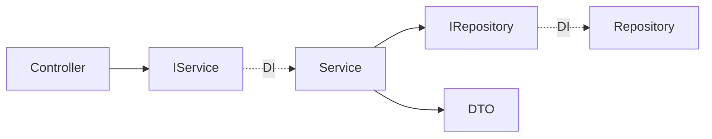
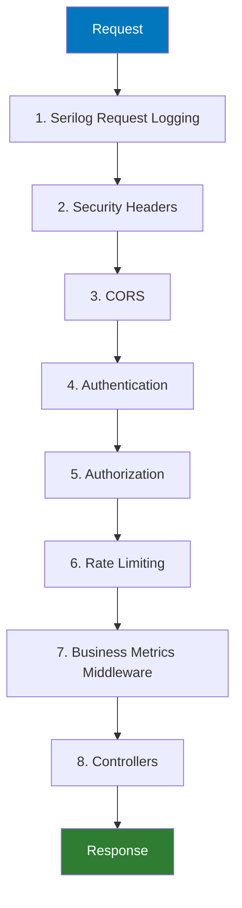

# Arquitetura do Backend

O backend do TepConfina e construido com **.NET 10** seguindo **Clean Architecture**. A solucao e composta por quatro projetos organizados em camadas com dependencias unidirecionais.

---

## Estrutura da Solution

```
TepConfina/
├── src/
│   ├── TepConfina.Domain/
│   │   ├── Entities/          # 16 entidades de dominio
│   │   ├── Enums/             # Enumeracoes de negocio
│   │   └── Interfaces/        # Contratos de repositorio
│   │
│   ├── TepConfina.Application/
│   │   ├── Services/          # 18+ servicos de negocio
│   │   ├── DTOs/              # Objetos de transferencia
│   │   ├── Interfaces/        # Contratos de servico
│   │   └── Validators/        # Regras de validacao
│   │
│   ├── TepConfina.Infrastructure/
│   │   ├── Data/
│   │   │   ├── AppDbContext.cs       # DbContext principal
│   │   │   └── Configurations/      # Fluent API configs
│   │   ├── Repositories/            # Implementacoes
│   │   └── Cache/                   # Redis cache service
│   │
│   └── TepConfina.API/
│       ├── Controllers/       # 17 controllers REST
│       ├── Middleware/         # Pipeline customizado
│       ├── Extensions/        # DependencyInjection.cs
│       └── Program.cs         # Entry point e pipeline
│
└── tests/
    ├── TepConfina.UnitTests/
    └── TepConfina.IntegrationTests/
```

---

## Camada Domain

O nucleo do sistema contem as **16 entidades** de dominio, sem dependencias externas.

| Entidade          | Descricao                                    |
|:------------------|:---------------------------------------------|
| `Lote`            | Lote de confinamento com datas e status       |
| `Animal`          | Animal individual com identificacao e raca    |
| `Pesagem`         | Registro de pesagem com peso e data           |
| `Racao`           | Formulacao de racao com ingredientes          |
| `Trato`           | Fornecimento diario de racao ao lote          |
| `PrecoMercado`    | Cotacao de arroba (legacy, alimenta dashboard) |
| `MarketContract`  | Contratos B3 disponíveis (ex: `BGI1!`, `BGIK26`) |
| `MarketQuote`     | Cotação atual por contrato (provider-agnóstico) |
| `MarketCandle`    | Candle OHLC para gráfico (timeframe + contrato) |
| `Produtor`        | Proprietario dos animais                      |
| `Compra`          | Transacao de compra de animais                |
| `CompraLote`      | Múltiplas compras por lote (rateio proporcional por animal) |
| `Venda`           | Transacao de venda de animais                 |
| `CustoOperacional`| Custos fixos e variaveis do confinamento      |
| `Alerta`          | Alerta automatico baseado em regras           |
| `Notificacao`     | Notificacao para o usuario                    |
| `Usuario`         | Usuario do sistema com perfil e permissoes    |
| `Tenant`          | Empresa/fazenda (multi-tenancy)               |
| `RefreshToken`    | Token de renovacao JWT                        |
| `AuditLog`        | Registro de auditoria de acoes                |

!!! note "Base Entity"
    Todas as entidades herdam de `BaseEntity`, que fornece `Id`, `CreatedAt`, `UpdatedAt`, `IsDeleted` e `TenantId`. O soft delete e o multi-tenancy sao aplicados via **global query filters** no EF Core.

---

## Camada Application

Contem a logica de negocio encapsulada em **18+ servicos**, cada um com sua interface correspondente.



Os servicos realizam:

- Validacao de regras de negocio
- Mapeamento manual entre entidades e DTOs
- Calculo de KPIs (GMD, custo/arroba, resultado financeiro)
- Orquestracao de operacoes entre repositorios

!!! tip "Mapeamento Manual"
    O projeto utiliza mapeamento manual em vez de AutoMapper. Isso permite calcular campos derivados (KPIs) diretamente no mapeamento, mantendo a logica explicita e depuravel.

---

## Camada Infrastructure

Implementa os contratos definidos nas camadas internas.

### DbContext

O `AppDbContext` configura:

- **Global query filters** para `IsDeleted` e `TenantId`
- **Fluent API** para mapeamento de entidades
- **Interceptors** para auditoria automatica (`CreatedAt`, `UpdatedAt`)

### Repositorios

| Repositorio              | Tipo          | Descricao                              |
|:-------------------------|:--------------|:---------------------------------------|
| `Repository<T>`          | Generico      | CRUD basico para todas as entidades    |
| `LoteRepository`         | Especializado | Queries com includes e KPIs            |
| `PrecoMercadoRepository` | Especializado | Cotacoes legacy (dashboard)            |
| `MarketRepository`       | Especializado | Quotes/Candles/Contracts com upsert    |
| `AnimalRepository`       | Especializado | Queries com historico de pesagens      |

### Redis Cache

O cache Redis e utilizado para:

- Cotacoes de mercado (TTL: 15 minutos)
- Dados de dashboard (TTL: 5 minutos)
- Sessoes de refresh token

---

## Camada API

### Controllers

Os **17 controllers** seguem o padrao RESTful com versionamento via URL (`/api/v1/`).

| Controller              | Endpoints | Descricao                         |
|:------------------------|:---------:|:----------------------------------|
| `AuthController`        | 4         | Login, registro, refresh, logout  |
| `LotesController`       | 6         | CRUD + fechar lote + KPIs        |
| `AnimaisController`     | 5         | CRUD + historico de pesagens     |
| `PesagensController`    | 4         | CRUD + pesagem em lote           |
| `RacoesController`      | 4         | CRUD de formulacoes              |
| `TratosController`      | 4         | Registro de tratos diarios       |
| `ProdutoresController`  | 4         | CRUD de produtores               |
| `ComprasController`     | 4         | Registro de compras              |
| `VendasController`      | 4         | Registro de vendas               |
| `CustosController`      | 4         | Gestao de custos operacionais    |
| `MarketController`      | 5         | Cotações/candles via provider ativo (TradingView) |
| `PrecoMercadoController`| 3         | Cotacoes legacy (dashboard)      |
| `AlertasController`     | 4         | Gestao de alertas                |
| `NotificacoesController`| 3         | Listagem e marcacao como lida    |
| `DashboardController`   | 3         | Metricas consolidadas            |
| `UsuariosController`    | 4         | Gestao de usuarios               |
| `TenantsController`     | 3         | Gestao de tenants (admin)        |
| `HealthController`      | 2         | Liveness e readiness probes      |

### Pipeline de Middleware

A ordem dos middlewares no `Program.cs` e critica para o funcionamento correto:



!!! warning "Ordem dos Middlewares"
    A autenticacao **deve** vir antes da autorizacao, e ambas antes do rate limiting. O middleware de metricas de negocio deve ser o ultimo antes dos controllers para capturar tempos de resposta precisos.

---

## Registro de Dependencias

Toda a configuracao de DI esta centralizada no metodo de extensao `AddTepConfinaServices()` em `DependencyInjection.cs`:

```csharp
public static class DependencyInjection
{
    public static IServiceCollection AddTepConfinaServices(
        this IServiceCollection services,
        IConfiguration configuration)
    {
        // Infrastructure
        services.AddDbContext<AppDbContext>(...);
        services.AddStackExchangeRedisCache(...);

        // Repositories
        services.AddScoped(typeof(IRepository<>), typeof(Repository<>));
        services.AddScoped<ILoteRepository, LoteRepository>();

        // Services
        services.AddScoped<IAuthService, AuthService>();
        services.AddScoped<ILoteService, LoteService>();
        // ... demais servicos

        return services;
    }
}
```

---

## Pipeline de Market Data

A ingestão de cotações usa o padrão **Provider + Background Hosted Service**, com abstração `IMarketDataProvider` para troca a quente entre fornecedores.

### Componentes

| Componente | Tipo | Função |
|-----------|------|--------|
| `IMarketDataProvider` | Interface | Contrato (GetContracts, GetLatestQuote, GetCandles, HealthCheck) |
| `TradingViewMarketDataProvider` | Implementação atual | HTTP para sidecar Node `tv-scraper` (porta 3001 na task ECS) |
| `BrapiMarketDataProvider` | Implementação | Fallback BBOI11 (cota do ETF, não é a arroba) |
| `MockMarketDataProvider` | Implementação | Dados sintéticos para dev local |
| `MarketIngestionHostedService` | BackgroundService | Roda a cada `MarketData:SyncIntervalSeconds` (300s default) |
| `MarketRepository` | Repositório | Upsert idempotente em `MarketContract`, `MarketQuote`, `MarketCandle` |
| `MarketQueryService` | Application service | Consultas para o `MarketController` |

### Fluxo

```mermaid
graph LR
    TV[TradingView WebSocket] -->|@mathieuc/tradingview| SIDECAR[tv-scraper Node :3001]
    SIDECAR -->|HTTP /candles /quote| PROVIDER[TradingViewMarketDataProvider]
    PROVIDER --> INGEST[MarketIngestionHostedService 5min]
    INGEST --> REPO[MarketRepository]
    REPO --> DB[(MarketCandles + MarketQuotes + PrecosMercado)]
    DB --> QUERY[MarketQueryService]
    QUERY --> CTRL[MarketController]
```

### Sidecar `tv-scraper` (Node.js)

Localizado em [`scrapers/tv/`](https://github.com/TecnoePec/tepconfina-api/tree/main/scrapers/tv), roda como **segundo container na task ECS** da API (`essential=false`).

- **Imagem:** `public.ecr.aws/docker/library/node:20-alpine` (mirror ECR Public para evitar rate-limit Docker Hub)
- **Endpoints expostos:** `/health`, `/quote?symbol=...`, `/candles?symbol=...&timeframe=...&limit=...`
- **Comunicação API → sidecar:** `http://localhost:3001` (network mode `awsvpc` compartilha interface)
- **Healthcheck:** wget `/health` a cada 30s
- **Build:** mesmo CodePipeline da API; `buildspec.yml` builda 2 imagens e atualiza task def com ambos containers

!!! warning "Risco de protocolo TradingView"
    A biblioteca `@mathieuc/tradingview` faz reverse engineering do WebSocket interno da TV. Quando a TV muda o protocolo, a lib pode ficar fora por dias até receber patch. Caminho de saída: contratar **Cedro Technologies** (R$ 440/mês) e trocar o provider — frontend e schema não mudam.

### Configuração

```json
"MarketData": {
  "Provider": "tradingview",          // tradingview | brapi | stonex | mock
  "SyncIntervalSeconds": 300,
  "ActiveContracts": [ "BGI1!" ],     // contratos puxados a cada ciclo
  "TradingView": {
    "SidecarUrl": "http://localhost:3001"
  },
  "Brapi": {
    "ApiBaseUrl": "https://brapi.dev",
    "ApiToken": ""                    // do Secrets Manager
  }
}
```

A troca de provider é zero-downtime: edita env var `MarketData__Provider` na task def e força novo deployment.

---

## Health Checks

O sistema expoe dois endpoints de health check:

| Endpoint           | Tipo       | Verifica                              |
|:-------------------|:-----------|:--------------------------------------|
| `/health/live`     | Liveness   | Aplicacao esta respondendo            |
| `/health/ready`    | Readiness  | PostgreSQL + Redis conectados         |

---

## Observabilidade

O backend integra **OpenTelemetry** para traces e metricas:

- **Traces**: Requisicoes HTTP, queries EF Core, chamadas Redis
- **Metricas**: Contadores de requisicao, latencia, erros por endpoint
- **Logs**: Serilog estruturado com enrichers de correlacao

!!! tip "Exporters"
    Em desenvolvimento, os dados sao exportados para o console. Em producao, sao enviados para o AWS X-Ray via OTLP exporter.

---

*Paginas relacionadas: [Visao Geral](visao-geral.md) | [Frontend](frontend.md) | [Mobile](mobile.md)*
