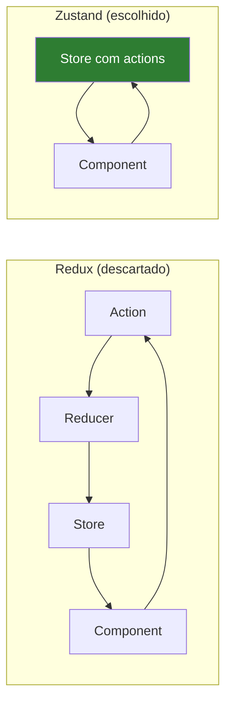
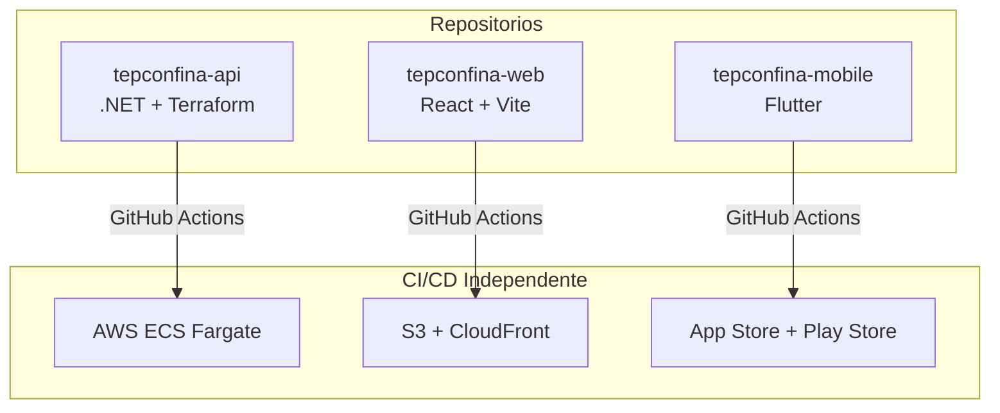

# Decisoes Tecnicas (ADRs)

Este documento registra as principais **Architecture Decision Records (ADRs)** do projeto TepConfina. Cada decisao inclui o contexto, a escolha feita e as consequencias.

---

## ADR-001: Clean Architecture sobre MVC

| Item         | Detalhe                                              |
|:-------------|:-----------------------------------------------------|
| **Status**   | Aceita                                               |
| **Data**     | 2025-06                                              |
| **Contexto** | O sistema precisa ser testavel, extensivel e com separacao clara de responsabilidades para evolucao a longo prazo. |

**Decisao:** Adotar Clean Architecture com quatro camadas (Domain, Application, Infrastructure, API) em vez de MVC tradicional.

**Consequencias:**

- Positivas: Testabilidade unitaria sem dependencia de infra, troca de banco/cache sem impacto no dominio, onboarding facilitado pela estrutura previsivel
- Negativas: Mais arquivos e projetos na solution, overhead inicial de setup

!!! tip "Trade-off"
    O custo adicional de boilerplate e compensado pela facilidade de manutencao a medida que o sistema cresce em complexidade.

---

## ADR-002: PostgreSQL sobre SQL Server

| Item         | Detalhe                                              |
|:-------------|:-----------------------------------------------------|
| **Status**   | Aceita                                               |
| **Data**     | 2025-06                                              |
| **Contexto** | O sistema sera hospedado na AWS e precisa de um banco relacional robusto com custo acessivel. |

**Decisao:** Utilizar PostgreSQL 15 em vez de SQL Server.

**Consequencias:**

- Positivas: Licenciamento gratuito, excelente suporte no AWS RDS, compatibilidade nativa com Linux/containers, performance superior para workloads analiticos (dashboards/KPIs)
- Negativas: Equipe com mais experiencia em SQL Server, algumas features especificas do SQL Server (ex: temporal tables) nao disponiveis nativamente

---

## ADR-003: EF Core sobre Dapper

| Item         | Detalhe                                              |
|:-------------|:-----------------------------------------------------|
| **Status**   | Aceita                                               |
| **Data**     | 2025-06                                              |
| **Contexto** | O backend precisa de um ORM para acesso a dados com suporte a migrations, change tracking e query filters. |

**Decisao:** Utilizar EF Core 10 como ORM principal em vez de Dapper.

**Consequencias:**

- Positivas: Migrations automaticas, global query filters (soft delete e multi-tenancy), change tracking para auditoria, produtividade do desenvolvedor
- Negativas: Overhead de performance em queries complexas, curva de aprendizado para otimizar queries geradas

!!! note "Dapper como Complemento"
    Para queries de dashboard com alta complexidade e necessidade de performance, Dapper pode ser adotado pontualmente sem substituir o EF Core como ORM principal.

---

## ADR-004: Zustand sobre Redux

| Item         | Detalhe                                              |
|:-------------|:-----------------------------------------------------|
| **Status**   | Aceita                                               |
| **Data**     | 2025-07                                              |
| **Contexto** | O frontend precisa de gerenciamento de estado local (autenticacao, UI) com o minimo de boilerplate. |

**Decisao:** Utilizar Zustand para estado local em vez de Redux Toolkit.

**Consequencias:**

- Positivas: API minimalista (~10 linhas para criar um store), sem boilerplate de actions/reducers/selectors, otimo suporte a TypeScript, bundle menor
- Negativas: Ecossistema menor que Redux, menos ferramentas de debug (embora Zustand suporte devtools)

---

## ADR-005: Flutter sobre React Native

| Item         | Detalhe                                              |
|:-------------|:-----------------------------------------------------|
| **Status**   | Aceita                                               |
| **Data**     | 2025-07                                              |
| **Contexto** | O aplicativo mobile precisa funcionar offline, ter boa performance em dispositivos de entrada e rodar em iOS e Android. |

**Decisao:** Utilizar Flutter 3 em vez de React Native.

**Consequencias:**

- Positivas: Performance nativa via compilacao AOT, UI consistente entre plataformas, Hive para armazenamento local rapido, ecossistema maduro para offline-first
- Negativas: Dart e menos popular que JavaScript/TypeScript, time precisa aprender nova linguagem, componentes nao utilizam widgets nativos do SO

---

## ADR-006: Multi-tenancy via coluna TenantId

| Item         | Detalhe                                              |
|:-------------|:-----------------------------------------------------|
| **Status**   | Aceita                                               |
| **Data**     | 2025-06                                              |
| **Contexto** | O sistema e SaaS e precisa isolar dados entre fazendas/empresas diferentes. |

**Decisao:** Implementar multi-tenancy via coluna `TenantId` em todas as tabelas com global query filter no EF Core, em vez de schema-per-tenant ou database-per-tenant.

**Consequencias:**

- Positivas: Simplicidade de implementacao, sem overhead de gerenciar multiplos schemas/bancos, migrations aplicadas uma unica vez, menor custo de infraestrutura
- Negativas: Risco de vazamento de dados se o filtro falhar, backup/restore por tenant mais complexo, todas as queries carregam o filtro adicional

!!! warning "Seguranca"
    O global query filter do EF Core garante que o `TenantId` seja aplicado automaticamente em **todas** as queries. Alem disso, o middleware extrai o `TenantId` do token JWT e o injeta no contexto, impossibilitando acesso cruzado entre tenants.

---

## ADR-007: Soft Delete sobre Hard Delete

| Item         | Detalhe                                              |
|:-------------|:-----------------------------------------------------|
| **Status**   | Aceita                                               |
| **Data**     | 2025-06                                              |
| **Contexto** | O sistema precisa manter trilha de auditoria e permitir recuperacao de dados excluidos acidentalmente. |

**Decisao:** Implementar soft delete via flag `IsDeleted` com global query filter, em vez de exclusao fisica.

**Consequencias:**

- Positivas: Trilha de auditoria completa, recuperacao de dados simplificada, integridade referencial preservada, conformidade com requisitos regulatorios
- Negativas: Crescimento do banco de dados ao longo do tempo, necessidade de jobs de limpeza periodica para dados antigos

---

## ADR-008: JWT + Refresh Token sobre sessao

| Item         | Detalhe                                              |
|:-------------|:-----------------------------------------------------|
| **Status**   | Aceita                                               |
| **Data**     | 2025-07                                              |
| **Contexto** | O sistema precisa autenticar usuarios em tres clientes diferentes (web, mobile, API) de forma stateless. |

**Decisao:** Utilizar JWT com access token de curta duracao (15 min) e refresh token de longa duracao (7 dias), em vez de sessoes server-side.

**Consequencias:**

- Positivas: Stateless (sem armazenamento de sessao no servidor), funciona nativamente com mobile, escalabilidade horizontal sem sticky sessions, padrao amplamente adotado
- Negativas: Revogacao imediata de tokens requer blacklist (Redis), refresh token precisa de armazenamento seguro no cliente

---

## ADR-009: Monorepo dividido em 3 repositorios

| Item         | Detalhe                                              |
|:-------------|:-----------------------------------------------------|
| **Status**   | Aceita                                               |
| **Data**     | 2025-08                                              |
| **Contexto** | O projeto possui tres aplicacoes (backend, frontend, mobile) com ciclos de deploy independentes. |

**Decisao:** Dividir o projeto em tres repositorios independentes (`tepconfina-api`, `tepconfina-web`, `tepconfina-mobile`) em vez de manter um monorepo.

**Consequencias:**

- Positivas: CI/CD independente por aplicacao, permissoes de acesso granulares, historico git limpo por contexto, times podem trabalhar em paralelo sem conflitos
- Negativas: Versionamento de contratos de API requer coordenacao, mudancas transversais exigem PRs em multiplos repos

---

## ADR-010: MkDocs Material sobre Docusaurus

| Item         | Detalhe                                              |
|:-------------|:-----------------------------------------------------|
| **Status**   | Aceita                                               |
| **Data**     | 2025-09                                              |
| **Contexto** | O projeto precisa de um site de documentacao tecnica com suporte a Mermaid, admonitions e busca. |

**Decisao:** Utilizar MkDocs com tema Material em vez de Docusaurus.

**Consequencias:**

- Positivas: Configuracao simples via YAML, suporte nativo a Mermaid e admonitions, tema Material polido e responsivo, deploy facil via GitHub Pages, escrito em Python (mais leve que Node.js)
- Negativas: Menos extensivel que Docusaurus para customizacoes complexas, comunidade menor no ecossistema JavaScript

!!! tip "Principio"
    A documentacao deve ser tao simples de manter quanto de ler. MkDocs Material permite que qualquer membro da equipe edite arquivos Markdown sem conhecer frameworks de frontend.

---

*Paginas relacionadas: [Visao Geral](visao-geral.md) | [Backend](backend.md) | [Frontend](frontend.md) | [Mobile](mobile.md)*
