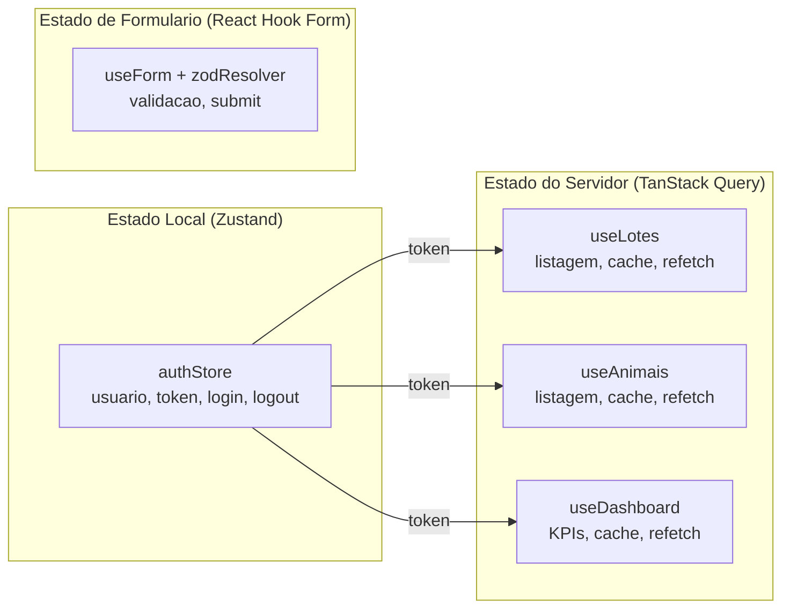
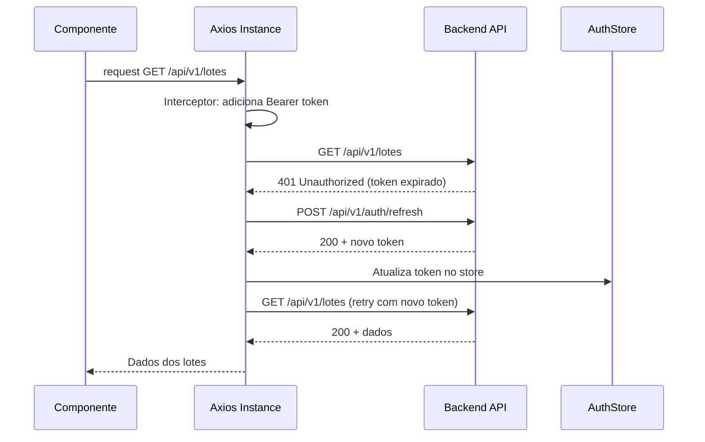

# Arquitetura do Frontend

O frontend do TepConfina e uma **SPA (Single Page Application)** construida com **React 18** e **Vite 5**, utilizando TypeScript para tipagem estatica e Tailwind CSS 3 para estilizacao.

---

## Stack Tecnologica

| Tecnologia       | Finalidade                                |
|:-----------------|:------------------------------------------|
| React 18         | Biblioteca de UI com concurrent features  |
| Vite 5           | Build tool com HMR ultra-rapido           |
| TypeScript       | Tipagem estatica                          |
| Tailwind CSS 3   | Framework CSS utility-first               |
| TanStack Query   | Gerenciamento de estado do servidor       |
| Zustand          | Gerenciamento de estado local             |
| React Hook Form  | Gerenciamento de formularios              |
| Zod              | Validacao de schemas                      |
| React Router     | Roteamento SPA                            |
| Recharts         | Graficos e visualizacoes                  |
| Axios            | Cliente HTTP                              |

---

## Estrutura do Projeto

```
src/
├── components/
│   ├── layout/
│   │   ├── AppLayout.tsx        # Layout principal com sidebar
│   │   ├── Sidebar.tsx          # Menu lateral responsivo
│   │   └── Header.tsx           # Cabecalho com usuario e notificacoes
│   ├── ui/
│   │   ├── DataTable.tsx        # Tabela com paginacao e ordenacao
│   │   ├── Button.tsx           # Botao com variantes
│   │   ├── Modal.tsx            # Modal reutilizavel
│   │   └── ...
│   └── charts/
│       ├── LineChart.tsx        # Grafico de linha (evolucao de peso)
│       └── BarChart.tsx         # Grafico de barras (custos)
│
├── pages/
│   ├── Dashboard.tsx            # Painel principal com KPIs
│   ├── Lotes/
│   │   ├── LotesPage.tsx        # Listagem de lotes
│   │   ├── LoteDetalhePage.tsx  # Detalhes e KPIs do lote
│   │   └── LoteFormPage.tsx     # Criacao/edicao de lote
│   ├── Animais/
│   ├── Pesagens/
│   ├── Racoes/
│   ├── Produtores/
│   ├── Financeiro/
│   ├── Mercado/
│   ├── Alertas/
│   ├── Notificacoes/
│   └── Usuarios/
│
├── services/
│   ├── api.ts                   # Instancia Axios configurada
│   ├── authService.ts           # Autenticacao e tokens
│   ├── loteService.ts           # Operacoes de lotes
│   └── ...                      # Demais servicos
│
├── stores/
│   └── authStore.ts             # Zustand store de autenticacao
│
├── hooks/
│   ├── useFeatureFlag.ts        # Hook de feature flags
│   └── ...
│
├── contexts/
│   └── FeatureFlagContext.tsx   # Provider de feature flags
│
├── types/
│   └── index.ts                 # Tipos TypeScript globais
│
├── utils/
│   └── formatters.ts            # Formatacao de moeda, data, peso
│
├── App.tsx                      # Rotas e providers
├── main.tsx                     # Entry point
└── index.css                    # Tailwind directives
```

---

## Gerenciamento de Estado

O frontend adota uma estrategia de **dois stores** para separar responsabilidades:



| Tipo de Estado    | Biblioteca       | Uso                                    |
|:------------------|:-----------------|:---------------------------------------|
| Autenticacao      | Zustand          | Usuario logado, tokens, permissoes     |
| Dados do servidor | TanStack Query   | Lotes, animais, pesagens, dashboards   |
| Formularios       | React Hook Form  | Validacao, submissao, estados de campo |
| Feature flags     | React Context    | Ativacao/desativacao de funcionalidades|

!!! tip "Por que dois stores?"
    **Zustand** e ideal para estado sincrono e local (autenticacao, UI). **TanStack Query** gerencia automaticamente cache, revalidacao, loading states e erro para dados vindos da API, eliminando boilerplate de reducers e actions.

---

## Integracao com API

A comunicacao com o backend e feita via **Axios** com interceptors configurados:



!!! warning "Refresh Token"
    O interceptor de refresh token utiliza uma **fila de requisicoes** para evitar multiplas chamadas simultaneas de renovacao. Enquanto o refresh esta em andamento, novas requisicoes sao enfileiradas e liberadas apos a renovacao.

---

## Roteamento

O roteamento utiliza **React Router** com protecao de rotas via `ProtectedRoute`:

```
/login                  → LoginPage (publica)
/                       → Dashboard (protegida)
/lotes                  → LotesPage (protegida)
/lotes/novo             → LoteFormPage (protegida)
/lotes/:id              → LoteDetalhePage (protegida)
/lotes/:id/editar       → LoteFormPage (protegida)
/animais                → AnimaisPage (protegida)
/pesagens               → PesagensPage (protegida)
/racoes                 → RacoesPage (protegida)
/produtores             → ProdutoresPage (protegida)
/financeiro             → FinanceiroPage (protegida)
/mercado                → MercadoPage (protegida)
/alertas                → AlertasPage (protegida)
/notificacoes           → NotificacoesPage (protegida)
/usuarios               → UsuariosPage (protegida, admin)
```

---

## Paleta de Cores

O Tailwind CSS esta configurado com cores customizadas alinhadas a identidade visual:

| Token         | Hex       | Uso                              |
|:--------------|:----------|:---------------------------------|
| `primary`     | `#008ED3` | Botoes principais, links, header |
| `secondary`   | `#009945` | Indicadores positivos, sucesso   |
| `accent`      | `#26AAB2` | Destaques, badges, graficos      |
| `neutral-800` | `#1B3A5C` | Textos, sidebar                  |
| `danger`      | `#DC2626` | Erros, alertas criticos, delete  |
| `warning`     | `#F59E0B` | Avisos, alertas moderados        |

---

## Componentes Principais

### DataTable

Tabela generica com suporte a:

- Paginacao server-side
- Ordenacao por coluna
- Filtros por campo
- Acoes por linha (editar, excluir, visualizar)
- Estado de loading com skeleton

### Dashboard

Painel principal com:

- Cards de KPIs (total de animais, lotes ativos, GMD medio, resultado financeiro)
- Grafico de evolucao de peso (Recharts LineChart)
- Grafico de custos por categoria (Recharts BarChart)
- Tabela de ultimos lotes com status

### Feature Flags

```typescript
// Uso do hook de feature flags
const { isEnabled } = useFeatureFlag();

if (isEnabled('modulo-financeiro')) {
  return <FinanceiroPage />;
}
```

!!! note "Feature Flags"
    O sistema de feature flags permite ativar/desativar modulos por tenant, facilitando o rollout gradual de funcionalidades e a customizacao por cliente.

---

## Build e Desenvolvimento

| Comando          | Descricao                                    |
|:-----------------|:---------------------------------------------|
| `npm run dev`    | Servidor de desenvolvimento (porta 5173)     |
| `npm run build`  | Build de producao otimizado                  |
| `npm run preview`| Preview do build de producao                 |
| `npm run lint`   | Analise estatica com ESLint                  |
| `npm run test`   | Execucao de testes com Vitest                |

!!! tip "Proxy de Desenvolvimento"
    O Vite esta configurado para fazer proxy de `/api` para `localhost:5000`, eliminando problemas de CORS durante o desenvolvimento local.

---

*Paginas relacionadas: [Visao Geral](visao-geral.md) | [Backend](backend.md) | [Mobile](mobile.md)*
