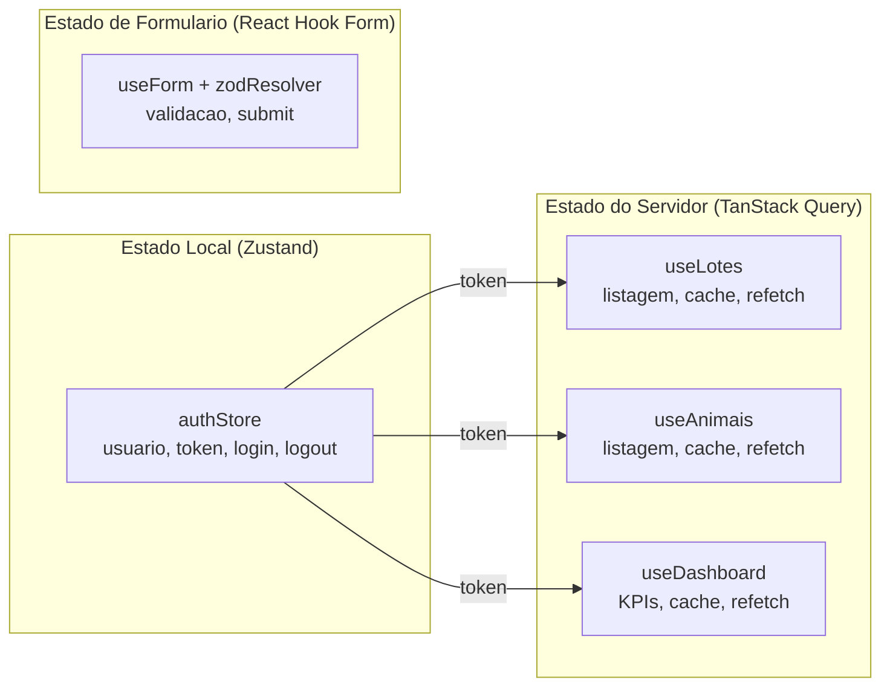
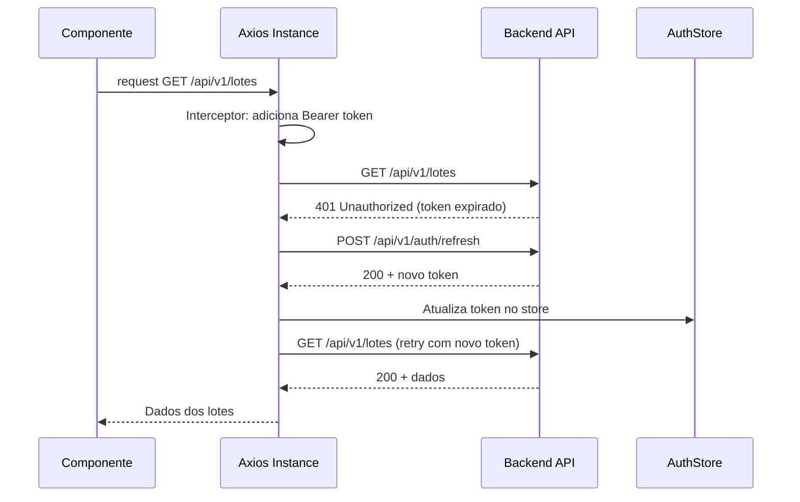

# Arquitetura do Frontend

O frontend do TepConfina e uma **SPA (Single Page Application)** construida com **React 18** e **Vite 5**, utilizando TypeScript para tipagem estatica e Tailwind CSS 3 para estilizacao.

---

## Stack Tecnologica

| Tecnologia       | Finalidade                                |
|:-----------------|:------------------------------------------|
| React 18         | Biblioteca de UI com concurrent features  |
| Vite 5           | Build tool com HMR ultra-rapido           |
| TypeScript       | Tipagem estatica                          |
| Tailwind CSS 3   | Framework CSS utility-first (dark mode `class` based) |
| TanStack Query   | Gerenciamento de estado do servidor       |
| Zustand          | Gerenciamento de estado local             |
| React Hook Form  | Gerenciamento de formularios (FormProvider para shared register/errors) |
| Zod              | Validacao de schemas                      |
| React Router     | `createBrowserRouter` + `RouterProvider` (data router API, suporta useBlocker) |
| Recharts 2.12    | Graficos e visualizacoes (CandleChart custom no Mercado) |
| Axios            | Cliente HTTP (interceptors auth/refresh)  |
| jsPDF            | Geracao de PDF client-side (relatorios + lote detalhado) |
| react-helmet-async | SEO/meta tags (13 paginas)              |
| VitePWA + Workbox | PWA com service worker autoUpdate        |
| @microsoft/signalr | Long Polling para PrecoAtualizado/PrecoAlerta (API Gateway REST nao suporta WebSocket) |

---

## Estrutura do Projeto

Estrutura **flat** — páginas no `src/pages/` raiz, abas do detalhe do lote em `src/pages/lote-tabs/`.

```
src/
├── components/
│   ├── layout/                  # AppLayout, Sidebar, Header
│   ├── ui/                      # DataTable, Button, Modal, ConfirmDialog,
│   │                            # SearchInput, Pagination, EmptyState,
│   │                            # PageTitle, Breadcrumb, TableSkeleton, ErrorBoundary
│   ├── icons/                   # Icones customizados (CowIcon)
│   ├── charts/                  # LineChart, BarChart
│   ├── dashboard/               # HojeSummary, PrevisaoVendaCard
│   └── mercado/                 # CandleChart, FuturesContractsCard, HedgeSimulator,
│                                # HedgeDecisionCard, HedgeLadder, HedgeHistory,
│                                # MapaPrecosBrasil, ReportarNegocioModal
│
├── pages/
│   ├── DashboardPage.tsx        # Painel com KPIs + Hoje + Previsao Venda
│   ├── LotesPage.tsx
│   ├── LoteFormPage.tsx         # Wizard 4 steps + edicao completa
│   ├── LoteDetalhePage.tsx      # 13 abas (resumo, compras, pesagens, racao,
│   │                            # med, sanitario, animais, previsao, suplementos,
│   │                            # arrendamentos, conferencia visual, gastos, graficos)
│   ├── lote-tabs/               # Componentes de cada aba
│   ├── AnimaisPage.tsx          # Lista global + Novo Animal + Cadastro em Lote
│   ├── PesagensPage.tsx
│   ├── RacoesPage.tsx
│   ├── RacaoFormPage.tsx
│   ├── ProdutoresPage.tsx
│   ├── ProdutorFormPage.tsx
│   ├── FinanceiroPage.tsx
│   ├── MercadoPage.tsx          # BGI1! candles + override @ + simuladores
│   ├── MercadoColaborativoPage.tsx
│   ├── SimuladorPage.tsx
│   ├── ComparativoLotesPage.tsx
│   ├── EstoqueInsumosPage.tsx
│   ├── AlertasPage.tsx
│   ├── NotificacoesPage.tsx
│   ├── RelatoriosPage.tsx
│   ├── ImportacaoPage.tsx
│   ├── AuditoriaPage.tsx
│   ├── AjudaPage.tsx
│   ├── AssinaturaPage.tsx
│   ├── PlanosPage.tsx
│   ├── AgentePage.tsx           # Chat com Agente IA
│   ├── ApiKeysPage.tsx
│   ├── UsuariosPage.tsx
│   ├── UsuarioFormPage.tsx
│   ├── TenantsPage.tsx
│   ├── CadastroPage.tsx         # Signup
│   └── LoginPage.tsx
│
├── services/
│   ├── api.ts                   # Axios + interceptors auth/refresh
│   ├── authService.ts
│   ├── loteService.ts
│   ├── animalService.ts
│   ├── marketService.ts         # /api/market/* (candles, quote, contracts)
│   ├── precoMercadoService.ts   # /api/precos-mercado/* (legacy dashboard)
│   ├── hedgeService.ts
│   ├── ...                      # 25+ services
│
├── stores/
│   └── authStore.ts             # Zustand: usuario, token, login/logout
│
├── hooks/
│   ├── useFeatureFlag.ts
│   ├── usePaginatedQuery.ts     # Wrapper TanStack Query + paginacao
│   ├── useSignalR.ts            # Long Polling para PrecoAtualizado/PrecoAlerta
│   ├── useUnsavedChanges.ts     # Blocker + ConfirmDialog
│   └── usePrecoArrobaManual.ts  # Override manual da @ (localStorage)
│
├── contexts/
│   └── FeatureFlagContext.tsx
│
├── lib/
│   ├── utils.ts                 # cn, formatCurrency, formatNumber, formatDate
│   ├── exportListPdf.ts         # Util generica de PDF
│   ├── relatorioLotePdf.ts      # PDF detalhado do lote
│   ├── calculateHedge.ts        # Logica do simulador de hedge
│   ├── getHedgeDecision.ts      # Engine de decisao (5 criterios)
│   └── helpContent.ts           # Conteudo da pagina /ajuda
│
├── types/                       # Tipos por dominio (lote.ts, animal.ts, ...)
├── test/                        # Vitest unit tests (17 arquivos, 178 testes)
├── e2e/                         # Playwright (4 specs, 42 testes contra producao)
├── router.tsx                   # createBrowserRouter + ProtectedRoute
├── App.tsx                      # RouterProvider + QueryClient + Providers
├── main.tsx
└── index.css
```

---

## Gerenciamento de Estado

O frontend adota uma estrategia de **dois stores** para separar responsabilidades:



| Tipo de Estado    | Biblioteca       | Uso                                    |
|:------------------|:-----------------|:---------------------------------------|
| Autenticacao      | Zustand          | Usuario logado, tokens, permissoes     |
| Dados do servidor | TanStack Query   | Lotes, animais, pesagens, dashboards   |
| Formularios       | React Hook Form  | Validacao, submissao, estados de campo |
| Feature flags     | React Context    | Ativacao/desativacao de funcionalidades|

!!! tip "Por que dois stores?"
    **Zustand** e ideal para estado sincrono e local (autenticacao, UI). **TanStack Query** gerencia automaticamente cache, revalidacao, loading states e erro para dados vindos da API, eliminando boilerplate de reducers e actions.

---

## Integracao com API

A comunicacao com o backend e feita via **Axios** com interceptors configurados:



!!! warning "Refresh Token"
    O interceptor de refresh token utiliza uma **fila de requisicoes** para evitar multiplas chamadas simultaneas de renovacao. Enquanto o refresh esta em andamento, novas requisicoes sao enfileiradas e liberadas apos a renovacao.

---

## Roteamento

O roteamento usa **`createBrowserRouter` + `RouterProvider`** (data router API), permitindo `useBlocker` para confirmar saída em formulários com mudanças não salvas. Configurado em `src/router.tsx`.

```
/login                  → LoginPage (publica)
/cadastro               → CadastroPage (publica)
/                       → DashboardPage (protegida)
/lotes                  → LotesPage
/lotes/novo             → LoteFormPage (wizard 4 steps)
/lotes/:id              → LoteDetalhePage (13 abas)
/lotes/:id/editar       → LoteFormPage
/animais                → AnimaisPage (com Novo Animal + Cadastro em Lote)
/pesagens               → PesagensPage
/racoes                 → RacoesPage
/racoes/novo            → RacaoFormPage
/produtores             → ProdutoresPage
/produtores/novo        → ProdutorFormPage
/produtores/:id/editar  → ProdutorFormPage
/financeiro             → FinanceiroPage
/mercado                → MercadoPage (BGI1! + override @ + simuladores)
/mercado-colaborativo   → MercadoColaborativoPage
/simulador              → SimuladorPage
/comparativo            → ComparativoLotesPage
/estoque                → EstoqueInsumosPage
/relatorios             → RelatoriosPage
/importacao             → ImportacaoPage
/auditoria              → AuditoriaPage (Admin)
/agente                 → AgentePage (chat IA)
/alertas                → AlertasPage
/notificacoes           → NotificacoesPage
/ajuda                  → AjudaPage
/assinatura             → AssinaturaPage
/planos                 → PlanosPage
/api-keys               → ApiKeysPage
/usuarios               → UsuariosPage (Admin)
/tenants                → TenantsPage (Admin)
/perfil                 → editar usuário logado
```

!!! note "Hooks de UX"
    `useUnsavedChanges` envolve formulários — bloqueia navegação e abre `ConfirmDialog` se houver mudanças não salvas. Funciona porque o data router suporta `useBlocker`.

---

## Paleta de Cores

O Tailwind CSS esta configurado com cores customizadas alinhadas a identidade visual:

| Token         | Hex       | Uso                              |
|:--------------|:----------|:---------------------------------|
| `primary`     | `#008ED3` | Botoes principais, links, header |
| `secondary`   | `#009945` | Indicadores positivos, sucesso   |
| `accent`      | `#26AAB2` | Destaques, badges, graficos      |
| `neutral-800` | `#1B3A5C` | Textos, sidebar                  |
| `danger`      | `#DC2626` | Erros, alertas criticos, delete  |
| `warning`     | `#F59E0B` | Avisos, alertas moderados        |

---

## Componentes Principais

### DataTable

Tabela generica com suporte a:

- Paginacao server-side
- Ordenacao por coluna
- Filtros por campo
- Acoes por linha (editar, excluir, visualizar)
- Estado de loading com skeleton

### Dashboard

Painel principal com:

- Cards de KPIs (total de animais, lotes ativos, GMD medio, resultado financeiro)
- Grafico de evolucao de peso (Recharts LineChart)
- Grafico de custos por categoria (Recharts BarChart)
- Tabela de ultimos lotes com status

### Feature Flags

```typescript
// Uso do hook de feature flags
const { isEnabled } = useFeatureFlag();

if (isEnabled('modulo-financeiro')) {
  return <FinanceiroPage />;
}
```

!!! note "Feature Flags"
    O sistema de feature flags permite ativar/desativar modulos por tenant, facilitando o rollout gradual de funcionalidades e a customizacao por cliente.

---

## Padrões cross-cutting

### Dark mode

Tailwind configurado com `darkMode: 'class'`. Toggle no Header persiste em `localStorage`. Todas as páginas e componentes têm variantes `dark:`.

### ErrorBoundary

Wrapper global em `App.tsx` captura exceções de render — mostra card full-screen com botão de reload e detalhes colapsáveis (apenas em dev). Evita tela branca em prod.

### Null safety

Todas as páginas tratam dados da API com `?? 0`, `?? []`, optional chaining e `Array.isArray()` antes de iterar. Convenção forte do projeto para evitar quebra quando a API retorna campos null/undefined.

### Português (textos com acento)

Toda label/placeholder/texto visível usa **acentos corretos** (Português BR). Variáveis e identificadores de código permanecem em ASCII (`pesoMedio`, não `pesoMedío`). Não alterar nomes de rotas/IDs.

### Real-time via SignalR

Hub URL: `VITE_API_URL + '/hubs/preco'` configurado em `useSignalR.ts`. Transporte forçado em **Long Polling** (`HttpTransportType.LongPolling`) porque o API Gateway REST não suporta WebSocket.

Eventos ouvidos:
- `PrecoAtualizado` — payload `{ precoArroba, variacao }` — atualiza dashboard sem refetch
- `PrecoAlerta` — payload `{ titulo, mensagem, precoArroba }` — toast + notificação

### PDF client-side

Util `exportListPdf` em `src/lib/exportListPdf.ts` aceita `{ title, columns, data }` e gera PDF tabular. `relatorioLotePdf.ts` é específico para o relatório completo do lote (capa, KPIs, gráficos render).

### SEO

`react-helmet-async` configurado no `App.tsx`. Cada página crítica (13 ao todo) define seu `<PageTitle>` que injeta `<title>` e meta description.

### PWA

VitePWA com `registerType: 'autoUpdate'` e Workbox. Service worker faz cache-first para assets estáticos e network-first para `/api/*`. Manifesto inclui ícone TepConfina e modo standalone.

### Acessibilidade

- ARIA labels em Sidebar, Header, e 7 tabelas principais
- Foco visível com `focus:ring-2`
- `aria-pressed` em botões toggle de filtro
- `aria-label` em botões de ação por linha (excluir, editar)

---

## Build e Desenvolvimento

| Comando          | Descricao                                    |
|:-----------------|:---------------------------------------------|
| `npm run dev`    | Servidor de desenvolvimento (porta 5173)     |
| `npm run build`  | Build de producao otimizado                  |
| `npm run preview`| Preview do build de producao                 |
| `npm run lint`   | Analise estatica com ESLint                  |
| `npm run test`   | Execucao de testes com Vitest                |

!!! tip "Proxy de Desenvolvimento"
    O Vite esta configurado para fazer proxy de `/api` para `localhost:5000`, eliminando problemas de CORS durante o desenvolvimento local.

---

*Paginas relacionadas: [Visao Geral](visao-geral.md) | [Backend](backend.md) | [Mobile](mobile.md)*
