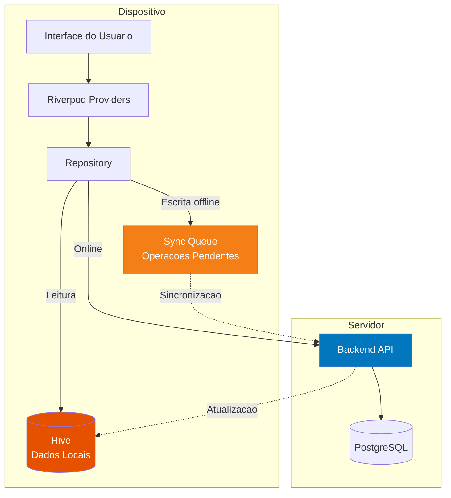
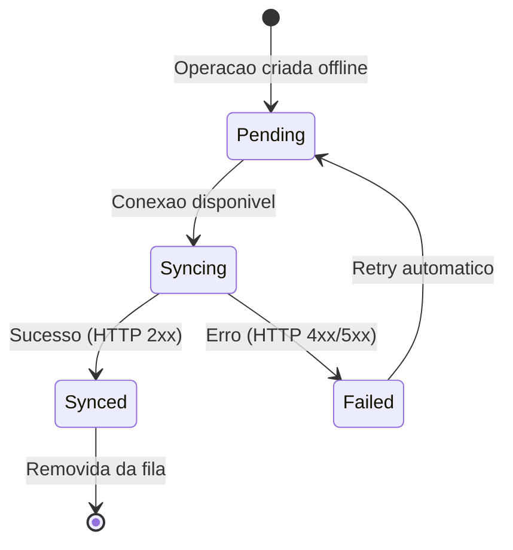
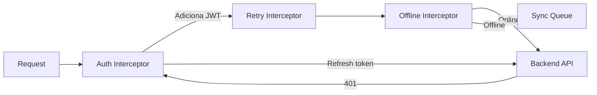

# Arquitetura do Mobile

O aplicativo mobile do TepConfina e desenvolvido com **Flutter 3**, priorizando a experiencia **offline-first** essencial para o ambiente rural onde a conectividade e instavel.

---

## Stack Tecnologica

| Tecnologia                | Finalidade                                 |
|:--------------------------|:-------------------------------------------|
| Flutter 3.38              | Framework multiplataforma (iOS + Android)  |
| Riverpod                  | Gerenciamento de estado reativo            |
| Hive                      | Banco de dados local (NoSQL, rapido)       |
| Dio                       | Cliente HTTP com interceptors              |
| GoRouter                  | Roteamento declarativo                     |
| Firebase Cloud Messaging  | Notificacoes push                          |
| Firebase Crashlytics      | Reporte automatico de crashes Android      |
| Flutter Secure Storage    | Armazenamento seguro de tokens             |
| TFLite Flutter            | Inferencia local do `cattle_detector.tflite` (43 MB, Git LFS) |
| `mocktail` 1.0.4          | Mocks para `flutter_test`                  |

**Destinos de produção:**

- Package: `br.com.tecnoepec.tepconfina`
- API: `--dart-define=ENV=production` aponta para `https://tepconfina-api.tecnoepec.com.br`
- minSdk: 26 (Android 8.0+)
- Distribuição: Firebase App Distribution (grupo `testers`) via CodePipeline; APK + AAB
- Tema: `ThemeMode.system` (segue dark mode do dispositivo)
- 33 telas no total

---

## Estrutura do Projeto

```
lib/
├── core/
│   ├── config/
│   │   ├── app_config.dart          # Configuracoes da aplicacao
│   │   └── environment.dart         # Variaveis de ambiente
│   ├── network/
│   │   ├── dio_client.dart          # Instancia Dio configurada
│   │   ├── auth_interceptor.dart    # Interceptor de autenticacao
│   │   ├── retry_interceptor.dart   # Retry com backoff exponencial
│   │   └── offline_interceptor.dart # Interceptor de fila offline
│   ├── storage/
│   │   ├── hive_service.dart        # Servico de acesso ao Hive
│   │   └── secure_storage.dart      # Wrapper do flutter_secure_storage
│   ├── sync/
│   │   ├── sync_service.dart        # Orquestrador de sincronizacao
│   │   ├── sync_queue.dart          # Fila de operacoes pendentes
│   │   └── conflict_resolver.dart   # Resolucao de conflitos
│   └── theme/
│       └── app_theme.dart           # Tema e cores do aplicativo
│
├── features/
│   ├── auth/
│   │   ├── data/                    # Repository, data sources
│   │   ├── domain/                  # Entities, use cases
│   │   └── presentation/           # Pages, widgets, providers
│   ├── dashboard/
│   ├── lotes/
│   ├── animais/
│   ├── pesagens/
│   ├── racoes/
│   └── notificacoes/
│
├── shared/
│   ├── widgets/                     # Widgets reutilizaveis
│   ├── utils/                       # Utilitarios (formatadores, etc.)
│   └── providers/                   # Providers globais
│
├── router/
│   └── app_router.dart              # Configuracao do GoRouter
│
└── main.dart                        # Entry point
```

!!! note "Feature-based Structure"
    Cada feature segue uma mini clean architecture com `data/`, `domain/` e `presentation/`, mantendo o codigo encapsulado e facilmente testavel.

---

## Arquitetura Offline-First

A estrategia offline-first garante que o aplicativo funcione sem internet, sincronizando dados quando a conexao e restabelecida.



### Fluxo de Leitura

1. O provider solicita dados ao repository
2. O repository verifica o **cache local** (Hive) primeiro
3. Se os dados estao no cache e sao recentes, retorna imediatamente
4. Em paralelo (se online), busca dados atualizados da API
5. Atualiza o cache local com os dados novos

### Fluxo de Escrita (Online)

1. O usuario cria/edita um registro
2. O repository envia para a API
3. Em caso de sucesso, atualiza o cache local
4. O provider notifica a UI

### Fluxo de Escrita (Offline)

1. O usuario cria/edita um registro
2. O repository salva no cache local com flag `pendingSync`
3. A operacao e adicionada a **sync queue**
4. A UI e atualizada imediatamente (otimista)
5. Quando a conexao e restabelecida, o `SyncService` processa a fila

---

## Fila de Sincronizacao

A sync queue armazena operacoes pendentes no Hive com a seguinte estrutura:

| Campo          | Tipo       | Descricao                            |
|:---------------|:-----------|:-------------------------------------|
| `id`           | `String`   | UUID unico da operacao               |
| `entity`       | `String`   | Tipo da entidade (lote, animal, etc) |
| `operation`    | `Enum`     | CREATE, UPDATE, DELETE               |
| `payload`      | `Map`      | Dados da operacao serializada        |
| `createdAt`    | `DateTime` | Momento da criacao                   |
| `retryCount`   | `int`      | Numero de tentativas realizadas      |
| `status`       | `Enum`     | PENDING, SYNCING, FAILED, SYNCED     |



!!! warning "Resolucao de Conflitos"
    Em caso de conflito (dado alterado no servidor enquanto estava offline), o sistema adota a estrategia **last-write-wins** com base no timestamp. Conflitos sao registrados no log e o usuario e notificado para revisao manual quando necessario.

---

## Interceptors do Dio

O cliente HTTP utiliza tres interceptors encadeados:



| Interceptor             | Responsabilidade                                    |
|:------------------------|:----------------------------------------------------|
| **Auth Interceptor**    | Adiciona header `Authorization: Bearer <token>`. Em caso de 401, tenta refresh automatico. |
| **Retry Interceptor**   | Retry com backoff exponencial para erros de rede (timeout, connection reset). Maximo 3 tentativas. |
| **Offline Interceptor** | Detecta ausencia de conexao e redireciona mutacoes (POST/PUT/DELETE) para a sync queue. |

---

## Notificacoes Push

O aplicativo utiliza **Firebase Cloud Messaging (FCM)** para receber notificacoes push:

- **Foreground**: Exibidas como banner in-app
- **Background**: Notificacao nativa do sistema operacional
- **Terminated**: Notificacao nativa com deep link para a tela relevante

| Tipo de Notificacao       | Origem                                     |
|:--------------------------|:-------------------------------------------|
| GMD vermelho              | `ProactiveAlertService` (backend, hora em hora) |
| Lote proximo da saida     | `ProactiveAlertService`                    |
| Variacao brusca de preco  | `ProactiveAlertService` quando BGI varia >2% em 24h |
| Estoque minimo            | `ProactiveAlertService`                    |
| Mortalidade fora do padrao| `ProactiveAlertService`                    |
| Alerta de preco do usuario| `AlertaPrecoService` quando o BGI atinge o valor configurado |
| Digest matinal            | `DailyDigestService` (5:30 BRT) — resumo do dia anterior |
| Sincronizacao             | Hive sync queue local                      |

---

## Armazenamento Seguro

Dados sensiveis sao armazenados utilizando **Flutter Secure Storage**:

| Dado                | Storage            | Motivo                             |
|:--------------------|:-------------------|:-----------------------------------|
| JWT Access Token    | Secure Storage     | Credencial de acesso               |
| Refresh Token       | Secure Storage     | Credencial de renovacao            |
| Dados de cache      | Hive               | Performance, acesso offline        |
| Sync queue          | Hive               | Persistencia de operacoes pendentes|
| Preferencias        | Hive               | Configuracoes do usuario           |

!!! tip "Seguranca no Hive"
    O Hive suporta **encriptacao AES-256** para boxes sensiveis. No TepConfina, os boxes que armazenam dados de animais e financeiros sao encriptados, enquanto boxes de configuracao e cache utilizam armazenamento padrao para melhor performance.

---

## Navegacao com GoRouter

O GoRouter fornece roteamento declarativo com suporte a deep links:

```
/login                  → LoginPage
/                       → DashboardPage
/lotes                  → LotesListPage
/lotes/:id              → LoteDetalhePage
/lotes/:id/animais      → AnimaisDoLotePage
/animais                → AnimaisListPage
/animais/:id            → AnimalDetalhePage
/pesagens               → PesagensPage
/pesagens/nova          → NovaPesagemPage
/racoes                 → RacoesPage
/notificacoes           → NotificacoesPage
```

---

## Modo Curral

Tela otimizada para uso **dentro do curral** (luva, mão suja, tela ao sol). UI simplificada com 4 botões gigantes e suporte a comando de voz.

| Botão | Ação |
|-------|------|
| 🐂 Pesagem | Câmera/teclado numérico para registrar peso individual (busca brinco por voz) |
| 💀 Mortalidade | Registra morte com data atual e causa por dropdown |
| 💉 Medicamento | Aplica medicamento a vários animais de uma vez (lê brincos por voz) |
| ↩ Sair | Volta ao app normal |

**Comando de voz** via Android STT (`speech_to_text`):

- "pesar B001 quatrocentos e vinte" → registra B001 com 420 kg
- "morte B042 pneumonia"
- "vacina B055 B056 B057"

Todas as ações entram na **sync queue Hive**, garantindo offline-first total.

---

## Conferência Visual (TF-Lite)

Detecção de cabeças de gado a partir de foto do lote, executada **localmente** no dispositivo (sem latência de rede e sem custo por imagem).

- **Modelo:** `assets/cattle_detector.tflite` (43 MB, gerenciado via **Git LFS** — `git lfs pull` necessário em CI)
- **Service:** `cattle_detector_service.dart`
- **Pipeline:** câmera → resize 320×320 → inferência TFLite → bounding boxes → contagem
- **ProGuard:** regras específicas em `android/app/proguard-rules.pro` para não obfuscar classes do TFLite (CodeBuild quebra sem isso)

A foto também é enviada para o backend para análise BCS via Claude Vision (assíncrono).

---

## Crashlytics e Boot Safety

### Reporte automático

Inicializado em `main.dart` antes do `runApp`. Crashes Android (uncaught exceptions, ANRs) caem em [console.firebase.google.com/project/tep-confina/crashlytics](https://console.firebase.google.com/project/tep-confina/crashlytics).

### Boot defensivo

`main.dart` envolve a inicialização de plugins críticos (Firebase, Hive, secure storage) em try/catch. Se algum falha, o app sobe em **modo degradado** com banner de erro em vez de tela branca:

```dart
try {
  await Firebase.initializeApp();
  await FirebaseCrashlytics.instance.setCrashlyticsCollectionEnabled(true);
  FlutterError.onError = FirebaseCrashlytics.instance.recordFlutterError;
} catch (e, stack) {
  // App sobe sem Crashlytics — log local e segue
  debugPrint('Firebase init failed: $e\n$stack');
}
```

---

## Build e Distribuição

| Comando | Descrição |
|---------|-----------|
| `flutter run` | Dev local apontando para localhost |
| `flutter build apk --dart-define=ENV=production` | APK para distribuição |
| `flutter build appbundle --dart-define=ENV=production` | AAB para Play Store |
| `flutter test` | 139 testes unitários |

**Pipeline CodeBuild** (`buildspec.yml` no `tepconfina-mobile`):

1. Instala Android SDK + Flutter
2. Baixa `google-services.json` do Secrets Manager
3. Decodifica keystore base64 do Secrets Manager (`development.TEPCONFINA_KEYSTORE`) para assinar release
4. Roda testes (139 unit + 8 integration em device real quando disponível)
5. Build APK + AAB com ProGuard
6. Upload para Firebase App Distribution → grupo `testers`

---

*Paginas relacionadas: [Visao Geral](visao-geral.md) | [Backend](backend.md) | [Frontend](frontend.md)*
