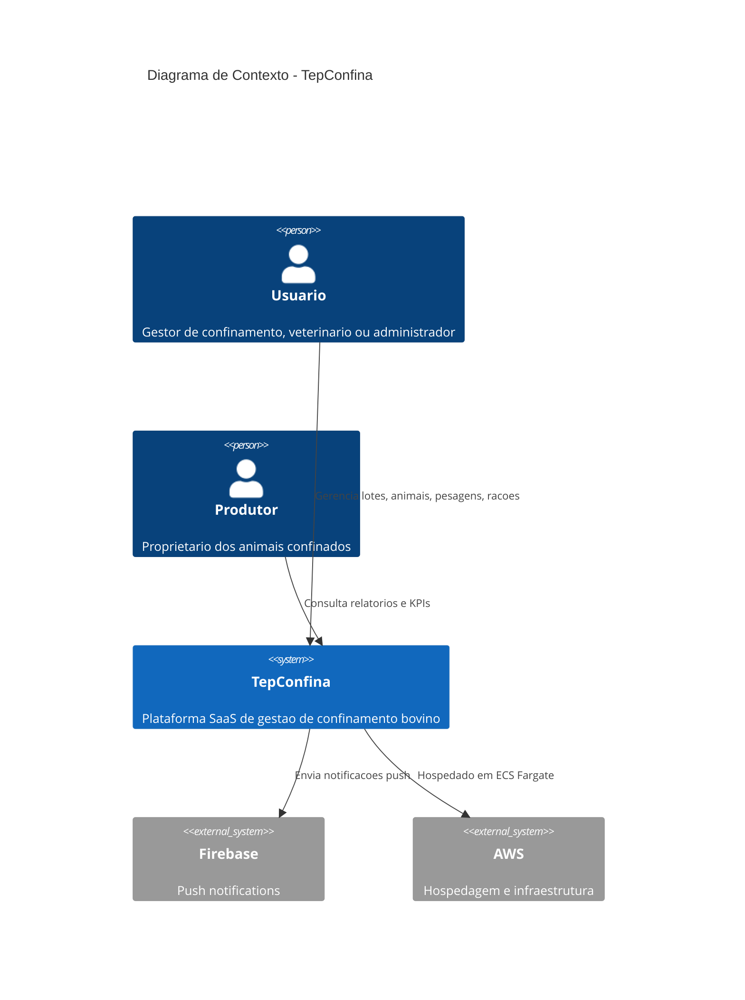
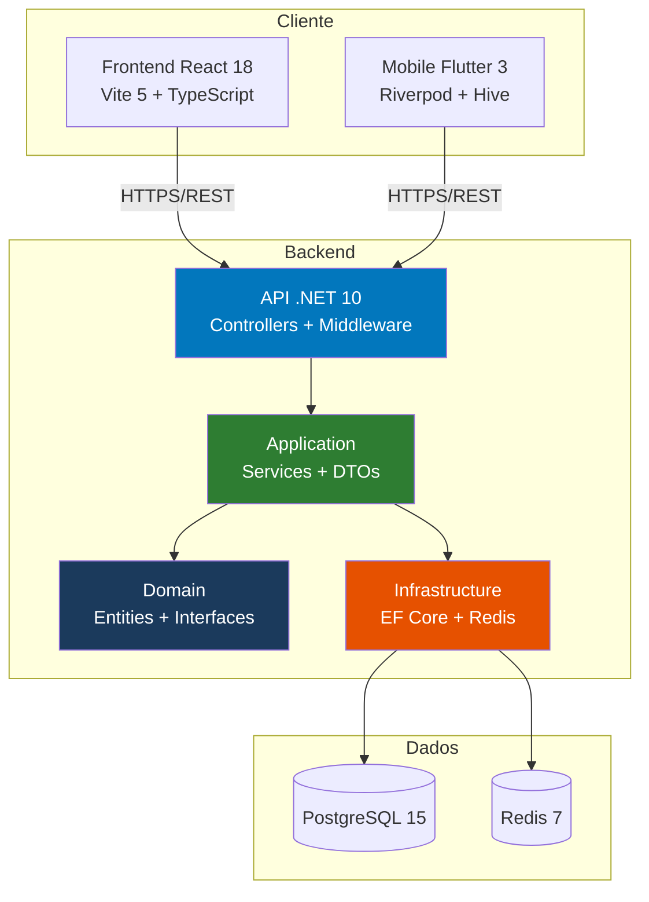
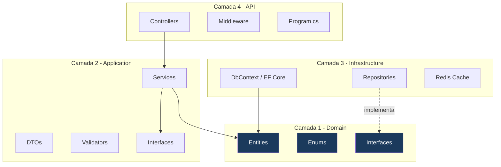

# Visao Geral da Arquitetura

O TepConfina segue uma arquitetura distribuida com tres aplicacoes independentes (backend, frontend e mobile) que se comunicam via API REST. O backend adota **Clean Architecture**, garantindo separacao de responsabilidades e testabilidade.

---

## Diagrama de Contexto (C4 - Nivel 1)

---

## Arquitetura de Aplicacoes

---

## Clean Architecture

O backend e organizado em quatro camadas concentricas. A **regra de dependencia** determina que camadas externas podem depender das internas, mas nunca o contrario.

| Camada             | Projeto                     | Responsabilidade                                    |
|:-------------------|:----------------------------|:----------------------------------------------------|
| **Domain**         | `TepConfina.Domain`         | Entidades, enums, interfaces de repositorio         |
| **Application**    | `TepConfina.Application`    | Servicos de negocio, DTOs, validadores, interfaces  |
| **Infrastructure** | `TepConfina.Infrastructure` | EF Core, repositorios, cache Redis, integracao      |
| **API**            | `TepConfina.API`            | Controllers, middleware, configuracao, DI            |

!!! warning "Regra de Dependencia"
    A camada **Domain** nao referencia nenhuma outra camada. Ela define interfaces que sao implementadas pela **Infrastructure**. A inversao de dependencia (DIP) e aplicada via injecao de dependencia no `Program.cs`.

---

## Estrutura de Repositorios

O projeto esta dividido em **tres repositorios independentes** para permitir CI/CD isolado e escalabilidade de equipe.

| Repositorio               | Conteudo                              | CI/CD                    |
|:--------------------------|:--------------------------------------|:-------------------------|
| `tepconfina-api`          | Backend .NET + Terraform              | GitHub Actions → AWS ECS |
| `tepconfina-web`          | Frontend React + Vite                 | GitHub Actions → S3/CloudFront |
| `tepconfina-mobile`       | App Flutter                           | GitHub Actions → App Store/Play Store |

---

## Padroes de Design

| Padrao                  | Aplicacao no TepConfina                                      |
|:------------------------|:-------------------------------------------------------------|
| **Repository Pattern**  | `Repository<T>` generico + repositorios especializados       |
| **CQRS-lite**           | Separacao de queries e commands nos services                  |
| **Soft Delete**         | `IsDeleted` + global query filter no EF Core                 |
| **Multi-tenancy**       | Coluna `TenantId` em todas as entidades + filtro global      |
| **DTO Mapping**         | Mapeamento manual com calculo de KPIs nos DTOs de resposta   |
| **Refresh Token**       | JWT de curta duracao + refresh token para renovacao silenciosa|
| **Offline Queue**       | Fila de mutacoes no mobile, sincronizada ao reconectar       |

!!! tip "Por que CQRS-lite?"
    Em vez de implementar CQRS completo com event sourcing e filas de mensagens, o TepConfina adota uma versao simplificada: os services possuem metodos separados para leitura (`Get`, `List`) e escrita (`Create`, `Update`, `Delete`), mantendo a simplicidade sem overhead de infraestrutura.

---

*Proximas paginas: [Backend](backend.md) | [Frontend](frontend.md) | [Mobile](mobile.md) | [Decisoes Tecnicas](decisoes-tecnicas.md)*
