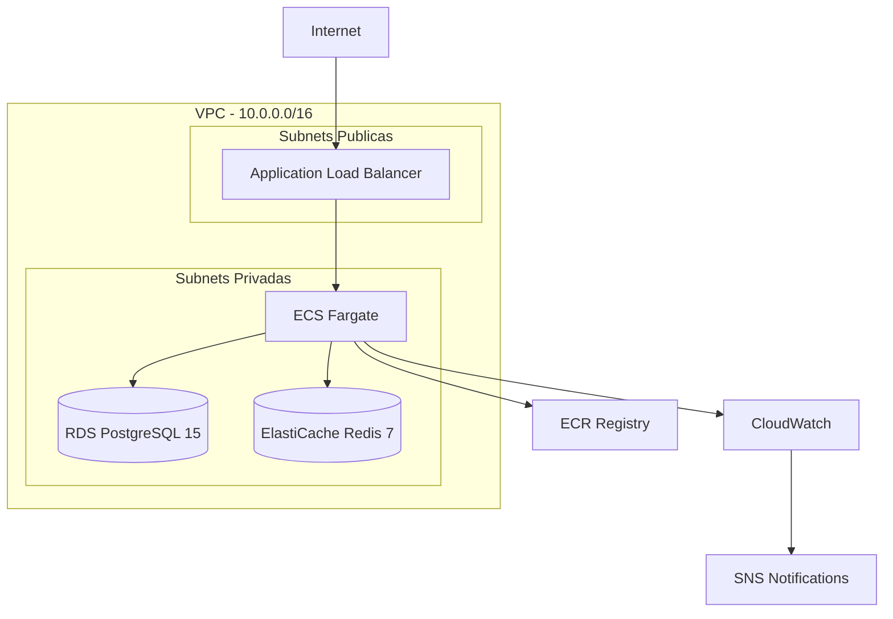
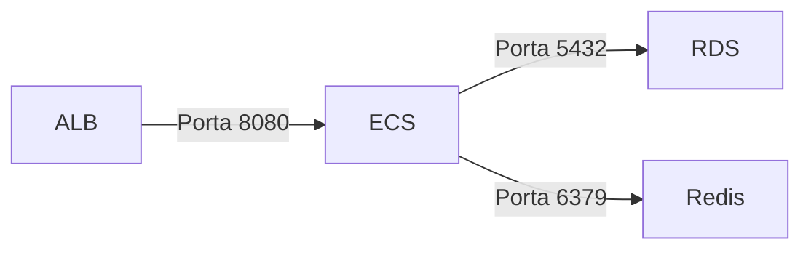

# Infraestrutura AWS

Arquitetura de infraestrutura do TepConfina na Amazon Web Services.

## Diagrama de Arquitetura

## Componentes

### VPC

| Recurso            | Configuracao                        |
|--------------------|-------------------------------------|
| CIDR               | `10.0.0.0/16`                       |
| Subnets publicas   | 2 (multi-AZ)                        |
| Subnets privadas   | 2 (multi-AZ)                        |
| NAT Gateway        | 1 por AZ                            |
| Internet Gateway   | 1                                   |

### Application Load Balancer

| Configuracao      | Valor                               |
|-------------------|-------------------------------------|
| Tipo              | Application (Layer 7)               |
| Subnets           | Publicas                            |
| Certificado SSL   | ACM (AWS Certificate Manager)       |
| Health check path | `/health`                           |
| Listeners         | 80 (redirect 443), 443 (HTTPS)      |

### ECS Fargate

| Configuracao         | Valor                              |
|----------------------|------------------------------------|
| Estrategia           | 50% Spot + 50% On-Demand          |
| CPU (task)           | 512 (0.5 vCPU)                     |
| Memoria (task)       | 1024 MB                            |
| Min tasks            | 1                                  |
| Max tasks            | 4                                  |
| Auto-scaling         | CPU > 70% ou Memoria > 80%        |
| Deploy strategy      | Rolling update                     |

!!! tip "Custo otimizado"
    A estrategia 50/50 Spot e On-Demand reduz custos em ate 35% mantendo alta disponibilidade. Se uma instancia Spot for interrompida, as On-Demand mantem o servico ativo.

### RDS PostgreSQL

| Configuracao         | Valor                              |
|----------------------|------------------------------------|
| Engine               | PostgreSQL 15                      |
| Classe               | db.t3.micro (dev) / db.r6g.large (prod) |
| Storage              | 20 GB gp3 (auto-scaling ate 100 GB)|
| Multi-AZ             | Sim (producao)                     |
| Backup retention     | 7 dias                             |
| Backup window        | 03:00-04:00 UTC                    |
| Encryption           | AES-256 (at rest)                  |
| Subnets              | Privadas                           |

### ElastiCache Redis

| Configuracao         | Valor                              |
|----------------------|------------------------------------|
| Engine               | Redis 7                            |
| Node type            | cache.t3.micro (dev) / cache.r6g.large (prod) |
| Encryption in-transit| Sim (TLS)                          |
| Encryption at-rest   | Sim (AES-256)                      |
| Auth token           | Sim                                |
| Subnets              | Privadas                           |

### CloudWatch

| Recurso              | Configuracao                       |
|----------------------|------------------------------------|
| Log group            | `/ecs/tepconfina-api`              |
| Alarms               | CPU, Memoria, 5xx, RDS, Redis     |
| Dashboard            | Metricas consolidadas              |
| Retention            | 30 dias (logs)                     |
| SNS topic            | Notificacoes por email             |

## Seguranca de Rede

!!! warning "Security Groups"
    - ALB: aceita trafego externo nas portas 80 e 443
    - ECS: aceita trafego apenas do ALB
    - RDS: aceita trafego apenas do ECS
    - Redis: aceita trafego apenas do ECS

## Estimativa de Custos (Staging)

| Servico        | Custo Mensal Estimado |
|----------------|-----------------------|
| ECS Fargate    | ~$15                  |
| RDS            | ~$15                  |
| ElastiCache    | ~$13                  |
| ALB            | ~$18                  |
| NAT Gateway    | ~$32                  |
| **Total**      | **~$93/mes**          |

!!! info "Custos de producao"
    Em producao, com instancias maiores e Multi-AZ, o custo estimado e de aproximadamente $350/mes.
