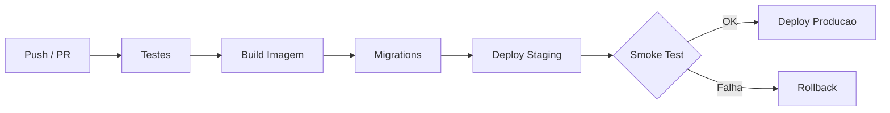

# CI/CD Pipelines

Visao geral dos pipelines de integracao e entrega continua do TepConfina.

## Fluxo Geral



## Repositorio: tepconfina-api

### Workflows

| Workflow               | Trigger                 | Descricao                                |
|------------------------|-------------------------|------------------------------------------|
| `ci.yml`               | Push / PR para `main`   | Build, testes unitarios e de integracao  |
| `deploy.yml`           | Merge em `main`         | Deploy para staging e producao           |
| `migration-check.yml`  | PR para `main`          | Valida migrations pendentes              |
| `terraform.yml`        | Alteracoes em `infra/`  | Plan/Apply de infraestrutura             |
| `rollback.yml`         | Manual (workflow_dispatch) | Rollback de emergencia                |

### ci.yml

```yaml
name: CI
on:
  push:
    branches: [main]
  pull_request:
    branches: [main]

jobs:
  build-and-test:
    runs-on: ubuntu-latest
    services:
      postgres:
        image: postgres:15-alpine
        env:
          POSTGRES_DB: tepconfina_test
          POSTGRES_USER: test
          POSTGRES_PASSWORD: test
    steps:
      - uses: actions/checkout@v4
      - uses: actions/setup-dotnet@v4
        with:
          dotnet-version: "10.0.x"
      - run: dotnet restore
      - run: dotnet build --no-restore
      - run: dotnet test --no-build --verbosity normal
```

### deploy.yml

Executa em duas etapas sequenciais:

1. **Staging**: Build da imagem Docker, push para ECR, migrations, deploy no ECS, smoke test
2. **Producao**: Requer aprovacao manual no GitHub Environment, repete o processo

!!! info "Ambientes GitHub"
    Os ambientes `staging` e `production` possuem regras de protecao. Producao exige aprovacao manual.

## Repositorio: tepconfina-web

### ci.yml

```yaml
name: CI Web
on:
  push:
    branches: [main]
  pull_request:
    branches: [main]

jobs:
  lint-test-build:
    runs-on: ubuntu-latest
    steps:
      - uses: actions/checkout@v4
      - uses: actions/setup-node@v4
        with:
          node-version: "20"
      - run: npm ci
      - run: npx tsc --noEmit
      - run: npx vitest run
      - run: npm run build
```

## Repositorio: tepconfina-mobile

### ci.yml

```yaml
name: CI Mobile
on:
  push:
    branches: [main]
  pull_request:
    branches: [main]

jobs:
  analyze-test-build:
    runs-on: ubuntu-latest
    steps:
      - uses: actions/checkout@v4
      - uses: subosito/flutter-action@v2
        with:
          flutter-version: "3.x"
      - run: flutter pub get
      - run: flutter analyze
      - run: flutter test
      - run: flutter build apk --release
```

## Ambientes

| Ambiente        | Branch   | Aprovacao  | URL                              |
|-----------------|----------|------------|----------------------------------|
| `staging`       | `main`   | Automatica | `https://staging.tepconfina.com` |
| `production`    | `main`   | Manual     | `https://app.tepconfina.com`     |
| `infrastructure`| `main`   | Manual     | N/A (Terraform)                  |

!!! warning "Protecao de producao"
    Deploys em producao sempre requerem aprovacao manual de pelo menos um membro da equipe no GitHub Environments.

## Segredos Configurados

| Segredo                   | Uso                        |
|---------------------------|----------------------------|
| `AWS_ACCESS_KEY_ID`       | Autenticacao AWS           |
| `AWS_SECRET_ACCESS_KEY`   | Autenticacao AWS           |
| `AWS_REGION`              | Regiao dos servicos        |
| `ECR_REPOSITORY`          | URI do repositorio ECR     |
| `DATABASE_URL`            | String de conexao do banco |
| `SLACK_WEBHOOK_URL`       | Notificacoes de deploy     |
