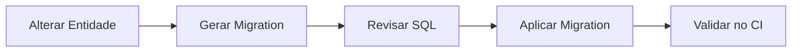
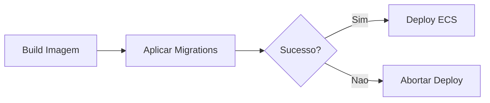

# Migrations

Gerenciamento de migrations do banco de dados com Entity Framework Core.

## Visao Geral

O TepConfina utiliza EF Core Migrations para versionamento do schema do banco de dados PostgreSQL. Todas as operacoes sao realizadas atraves do script `migrate.sh`.



## Script migrate.sh

O script centraliza todas as operacoes de migration:

```bash
./scripts/migrate.sh <comando> [opcoes]
```

### Comandos Disponiveis

| Comando    | Descricao                                          |
|------------|-----------------------------------------------------|
| `status`   | Lista todas as migrations e seu estado              |
| `apply`    | Aplica todas as migrations pendentes                |
| `rollback` | Reverte a ultima migration aplicada                 |
| `dry-run`  | Gera o SQL que seria executado sem aplicar          |
| `add`      | Cria uma nova migration                             |

### Exemplos de Uso

```bash
# Verificar migrations pendentes
./scripts/migrate.sh status

# Aplicar migrations pendentes
./scripts/migrate.sh apply

# Reverter a ultima migration
./scripts/migrate.sh rollback

# Gerar SQL sem aplicar (dry-run)
./scripts/migrate.sh dry-run

# Criar nova migration
./scripts/migrate.sh add "AdicionarTabelaAnimais"
```

## Criando uma Nova Migration

### 1. Altere a entidade no Domain

```csharp
public class Animal : BaseEntity
{
    public string Identificacao { get; set; } = string.Empty;
    public Guid LoteId { get; set; }
    public string Raca { get; set; } = string.Empty;
    // Nova propriedade
    public decimal PesoIdeal { get; set; }
}
```

### 2. Gere a migration

```bash
./scripts/migrate.sh add "AdicionarPesoIdealAnimal"
```

### 3. Revise o arquivo gerado

!!! warning "Sempre revise"
    Verifique o SQL gerado antes de aplicar. Migrations automaticas podem gerar operacoes destrutivas como drop de colunas.

### 4. Aplique a migration

```bash
./scripts/migrate.sh apply
```

## Validacao no CI

### migration-check.yml

O workflow `migration-check.yml` e executado automaticamente em Pull Requests que alteram arquivos de migrations:

```yaml
name: Migration Check
on:
  pull_request:
    paths:
      - "src/TepConfina.Infrastructure/Migrations/**"
      - "src/TepConfina.Domain/Entities/**"

jobs:
  validate:
    runs-on: ubuntu-latest
    services:
      postgres:
        image: postgres:15-alpine
    steps:
      - uses: actions/checkout@v4
      - run: dotnet restore
      - run: dotnet build
      - run: ./scripts/migrate.sh dry-run
      - run: ./scripts/migrate.sh apply
```

O pipeline verifica:

- Se a migration pode ser gerada sem erros
- Se o SQL e valido
- Se pode ser aplicada em um banco limpo

## Migrations no Deploy

O workflow `deploy.yml` executa migrations automaticamente antes de cada deploy:



!!! info "Migrations antes do deploy"
    As migrations sao aplicadas antes do deploy da nova versao, garantindo que o banco esteja compativel com o novo codigo.

## Rollback de Migration

Para reverter a ultima migration aplicada:

```bash
./scripts/migrate.sh rollback
```

!!! danger "Cuidado com rollbacks"
    Rollbacks podem causar perda de dados se a migration removida continha colunas com dados. Sempre avalie o impacto antes de executar.

### Procedimento de Rollback em Producao

1. Verifique a migration a ser revertida: `./scripts/migrate.sh status`
2. Execute o dry-run: `./scripts/migrate.sh dry-run`
3. Confirme que nao havera perda de dados criticos
4. Execute o rollback: `./scripts/migrate.sh rollback`
5. Valide o estado do banco: `./scripts/migrate.sh status`

## Boas Praticas

- Sempre revise o SQL gerado antes de aplicar
- Nao edite migrations ja aplicadas em producao
- Crie migrations pequenas e focadas
- Adicione dados de seed via migrations quando necessario
- Teste migrations em ambiente local antes de enviar o PR
