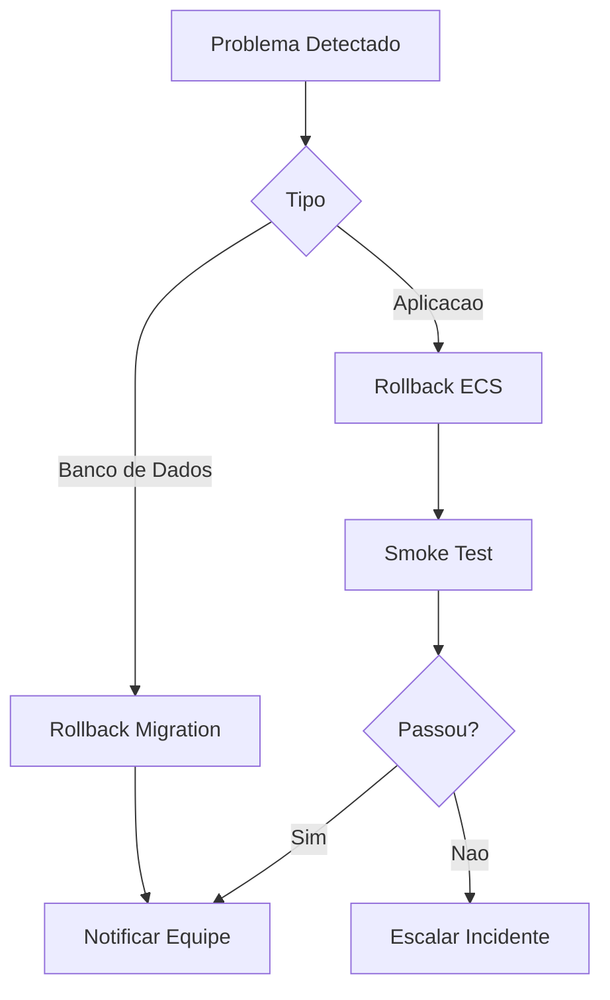
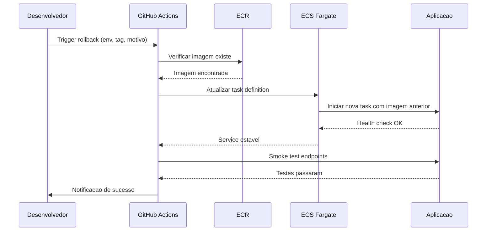

# Rollback

Procedimentos de rollback de emergencia para o TepConfina.

## Visao Geral

O rollback permite reverter rapidamente para uma versao anterior em caso de problemas apos o deploy.



## Rollback da Aplicacao (ECS)

### Via GitHub Actions

O workflow `rollback.yml` permite rollback manual pelo GitHub:

```yaml
name: Rollback
on:
  workflow_dispatch:
    inputs:
      environment:
        description: "Ambiente"
        required: true
        type: choice
        options:
          - staging
          - production
      image_tag:
        description: "Tag da imagem (commit SHA)"
        required: true
        type: string
      reason:
        description: "Motivo do rollback"
        required: true
        type: string
```

### Como executar

1. Acesse **Actions** no repositorio `tepconfina-api`
2. Selecione o workflow **Rollback**
3. Clique em **Run workflow**
4. Preencha os campos:

| Campo         | Descricao                                       | Exemplo          |
|---------------|--------------------------------------------------|------------------|
| `environment` | Ambiente alvo                                   | `production`     |
| `image_tag`   | SHA do commit da versao estavel                 | `a1b2c3d`        |
| `reason`      | Motivo do rollback                              | `Bug no calculo GMD` |

5. Confirme a execucao

### Etapas do Workflow

O workflow executa as seguintes etapas automaticamente:

1. **Validacao**: Verifica se a imagem com a tag informada existe no ECR
2. **Update Service**: Atualiza o ECS service para usar a imagem anterior
3. **Wait for Stability**: Aguarda o ECS estabilizar com a nova task
4. **Smoke Test**: Executa testes de saude nos endpoints criticos
5. **Notificacao**: Envia alerta via Slack/Email com detalhes do rollback



### Smoke Test

Apos o rollback, os seguintes endpoints sao verificados automaticamente:

| Endpoint          | Verificacao                    |
|-------------------|-------------------------------|
| `GET /health`     | Status 200                    |
| `POST /api/auth/login` | Autenticacao funcional   |
| `GET /api/lotes`  | Listagem retorna dados        |

!!! info "Falha no smoke test"
    Se o smoke test falhar apos o rollback, o workflow notifica a equipe para investigacao manual. Pode indicar que o problema e no banco de dados e nao na aplicacao.

## Rollback de Banco de Dados

### Via Script

```bash
./scripts/migrate.sh rollback
```

### Procedimento Completo

!!! danger "Risco de perda de dados"
    Rollback de migrations pode causar perda de dados. Sempre avalie o impacto antes de executar em producao.

1. **Identificar a migration problematica**

```bash
./scripts/migrate.sh status
```

2. **Verificar o SQL de rollback**

```bash
./scripts/migrate.sh dry-run
```

3. **Fazer backup do banco**

```bash
pg_dump -h <host> -U <user> -d tepconfina > backup_pre_rollback.sql
```

4. **Executar o rollback**

```bash
./scripts/migrate.sh rollback
```

5. **Validar o estado do banco**

```bash
./scripts/migrate.sh status
```

## Identificando a Versao Estavel

Para encontrar o SHA do ultimo deploy estavel:

```bash
# Listar ultimos deploys via GitHub CLI
gh run list --workflow=deploy.yml --status=success --limit=5
```

## Checklist de Rollback

- [ ] Identificar a causa raiz do problema
- [ ] Comunicar a equipe sobre o rollback
- [ ] Verificar se e necessario rollback de migration
- [ ] Executar rollback da aplicacao
- [ ] Validar smoke tests
- [ ] Verificar metricas no CloudWatch
- [ ] Documentar o incidente
- [ ] Planejar correcao definitiva

!!! success "Pos-rollback"
    Apos o rollback, crie uma issue documentando o problema, a causa raiz e o plano de correcao para evitar recorrencia.
