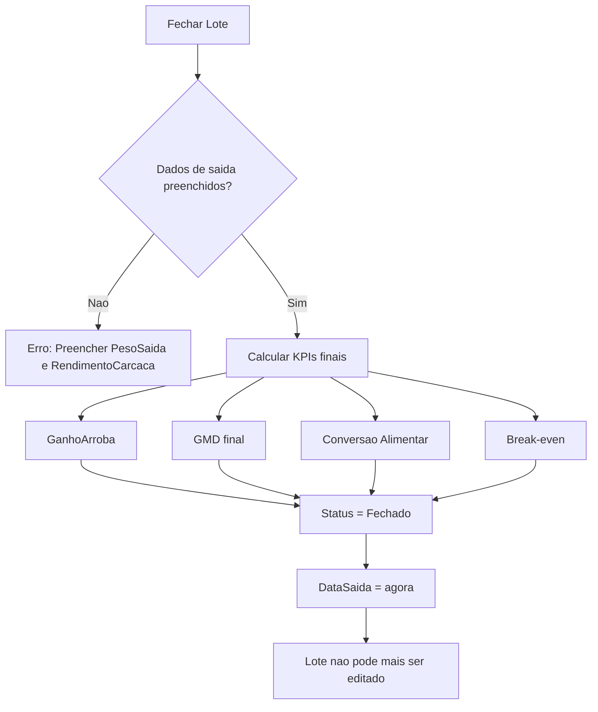

# Regras de Negocio

Formulas, calculos e regras de negocio do sistema TepConfina.

## Calculos de Peso

### Peso Medio

O peso medio e calculado dividindo o peso liquido total pela quantidade de animais:

```
PesoMedio = PesoLiquido / QuantidadeAnimais
```

!!! example "Exemplo"
    Peso liquido do lote: 15.000 kg, quantidade: 30 animais.
    Peso medio = 15.000 / 30 = **500 kg/cabeca**

### Peso em Arrobas

A conversao de quilogramas para arrobas utiliza o fator padrao de 15 kg:

```
PesoArroba = Peso / 15
```

| Peso (kg) | Peso (@)  |
|-----------|-----------|
| 300       | 20,00     |
| 450       | 30,00     |
| 510       | 34,00     |

!!! info "Convencao"
    No mercado pecuario brasileiro, 1 arroba (@) equivale a 15 kg de carcaca.

## Rendimento de Carcaca

Percentual do peso vivo que se converte em carcaca apos o abate:

```
RendimentoCarcaca = (PesoCarcaca / PesoVivo) * 100
```

!!! example "Exemplo"
    Animal com 540 kg de peso vivo e 291,6 kg de carcaca.
    Rendimento = (291,6 / 540) * 100 = **54%**

### Faixas de Referencia

| Classificacao | Rendimento       |
|---------------|------------------|
| Baixo         | < 50%            |
| Adequado      | 50% - 54%        |
| Bom           | 54% - 56%        |
| Excelente     | > 56%            |

## Ganho em Arrobas

Calculo do ganho liquido em arrobas durante o periodo de confinamento:

```
GanhoArroba = (PesoSaida * RendimentoCarcaca/100 - PesoEntrada) / 15
```

!!! example "Exemplo"
    Peso de saida: 540 kg, rendimento: 54%, peso de entrada: 360 kg.
    Ganho = (540 * 0,54 - 360) / 15 = (291,6 - 360) / 15
    Neste caso, considera-se o peso de carcaca na saida vs entrada.

## GMD - Ganho Medio Diario

Taxa de ganho de peso diario entre duas pesagens:

```
GMD = (PesoAtual - PesoAnterior) / DiasEntrePesagens
```

!!! example "Exemplo"
    Peso anterior: 450 kg (dia 0), peso atual: 492 kg (dia 28).
    GMD = (492 - 450) / 28 = **1,50 kg/dia**

### Faixas de Referencia GMD

| Classificacao | GMD (kg/dia) |
|---------------|--------------|
| Baixo         | < 1,00       |
| Adequado      | 1,00 - 1,40  |
| Bom           | 1,40 - 1,80  |
| Excelente     | > 1,80       |

## Conversao Alimentar

Relacao entre a quantidade de racao consumida e o ganho de peso:

```
ConversaoAlimentar = KgRacaoConsumida / KgGanhoPeso
```

!!! example "Exemplo"
    Racao consumida: 252 kg, ganho de peso: 42 kg.
    Conversao = 252 / 42 = **6:1** (6 kg de racao para cada 1 kg de ganho)

### Faixas de Referencia

| Classificacao | Conversao  |
|---------------|------------|
| Excelente     | < 5:1      |
| Bom           | 5:1 - 6:1  |
| Adequado      | 6:1 - 7:1  |
| Ruim          | > 7:1      |

## Break-even (Ponto de Equilibrio)

Calculo do preco minimo da arroba para cobrir os custos:

```
BreakEven = CustoTotal / QuantidadeAnimais / PrecoArroba
```

Onde `CustoTotal` inclui:

- Custo de aquisicao dos animais
- Custo total de racao consumida
- Custo de medicamentos aplicados
- Outros gastos operacionais

!!! warning "Importancia"
    O break-even e fundamental para a decisao de venda. Se o preco de mercado da arroba esta abaixo do break-even, o lote esta operando em prejuizo.

## Regras de Fechamento de Lote

Ao fechar um lote, as seguintes regras sao aplicadas:



!!! danger "Lote Fechado"
    Uma vez que o lote e fechado, nao e possivel editar seus dados. Todos os KPIs finais sao calculados e armazenados no momento do fechamento.

### Campos obrigatorios para fechamento

| Campo             | Obrigatorio | Descricao                          |
|-------------------|-------------|-------------------------------------|
| PesoSaida         | Sim         | Peso total dos animais na saida    |
| RendimentoCarcaca  | Sim         | Percentual de rendimento           |

### KPIs calculados automaticamente

| KPI                | Formula                                            |
|--------------------|-----------------------------------------------------|
| GanhoArroba        | (PesoSaida * Rendimento/100 - PesoEntrada) / 15   |
| GMD                | (PesoMedioSaida - PesoMedioEntrada) / DiasConfinamento |
| ConversaoAlimentar | TotalRacaoConsumida / TotalGanhoPeso               |
| CustoTotal         | Aquisicao + Racao + Medicamentos + Outros          |

---

## GMD — Semáforo Visual

O frontend exibe um indicador colorido (verde/amarelo/vermelho) para sinalizar o desempenho do GMD em listagens e cards de lote.

| Cor | Threshold (kg/dia) | Significado |
|-----|--------------------|-------------|
| 🟢 Verde | GMD ≥ 1.2 | Adequado a excelente para Nelore confinamento |
| 🟡 Amarelo | 0.9 ≤ GMD < 1.2 | Aceitável, monitorar |
| 🔴 Vermelho | GMD < 0.9 ou null | Abaixo do esperado ou sem pesagem registrada |

A `IA Proativa` dispara alerta quando um lote fica vermelho por 3 pesagens consecutivas.

---

## Margem Real (CompraLote)

Quando um lote tem múltiplas `CompraLote`, o custo de aquisição é **rateado proporcionalmente ao peso de entrada** de cada compra. Cada animal recebe um `CustoAnimal.CustoCompra` individual.

```
CustoAnimalIndividual = (PesoEntradaAnimal / PesoEntradaTotalDoLote) × ValorTotalCompras
```

A margem real de cada animal vendido é calculada como:

```
MargemReal = ValorVenda - CustoAnimal.CustoCompra - CustoOperacionalAcc
```

O `CustoOperacionalAcc` é incrementado proporcionalmente sempre que há lançamento de ração, medicamento, suplemento, arrendamento ou outros gastos no lote.

---

## Hedge — Cálculos

### Contratos BGI a vender

Cada contrato BGI da B3 representa **330 arrobas**. Para travar uma fração `% hedge` de um lote:

```
ArrobasTotais = QuantidadeAnimais × ArrobasPorCabeca
ArrobasHedge = ArrobasTotais × (% hedge)
ContratosTeoricos = ArrobasHedge / 330
ContratosSugeridos = arredondamento(ContratosTeoricos, modo)
```

| Modo | Arredondamento | Quando usar |
|------|----------------|-------------|
| **Conservador** | floor (piso) | Quer minimizar custo do hedge, aceita ficar parcialmente exposto |
| **Balanceado** | round (padrão) | Default — equilíbrio risco/custo |
| **Proteção Máxima** | ceil (teto) | Quer cobertura total, aceita sobreproteger |

```
CoberturaReal = (ContratosSugeridos × 330) / ArrobasTotais
ExposicaoResidual = ArrobasTotais - (ContratosSugeridos × 330)
```

`ExposicaoResidual` positiva = lote ainda parcialmente descoberto. Negativa = sobreproteção.

### Valor protegido

```
ValorProtegido = ContratosSugeridos × 330 × PrecoArrobaAtual
```

`PrecoArrobaAtual` vem do BGI1! ou do override manual da página Mercado.

---

## Decision Engine — Momento Ideal de Trava

Score 0–100 calculado como **média ponderada de 5 critérios**, retorna recomendação categórica.

### Pesos

| Critério | Peso |
|----------|------|
| Preço (distância ao alvo) | 35% |
| Margem (vs custo + meta) | 30% |
| Base (físico vs futuro) | 15% |
| Tendência (médias 7d vs 30d) | 10% |
| Volatilidade (desvio padrão histórico) | 10% |

### Cálculo de cada critério (0–100)

**ScorePreco** — quanto mais próximo o preço atual do alvo, maior:
```
distanciaPct = (PrecoAlvo - PrecoAtual) / PrecoAlvo
ScorePreco = 100 - clamp(|distanciaPct| × 1000, 0, 100)
```

**ScoreMargem** — margem por arroba vs meta:
```
MargemArroba = PrecoFisicoLocal - CustoTotalPorArroba
ScoreMargem = clamp((MargemArroba / MargemMetaPorArroba) × 100, 0, 100)
```

**ScoreBase** — base é a diferença entre físico e futuro:
```
Base = PrecoFisicoLocal - PrecoAtual
basePct = Base / historicoBaseMedia (com proteção contra div/0)
ScoreBase = 50 + clamp(basePct × 30, -50, 50)
```

**ScoreTendencia** — comparação Média 7d vs 30d:
```
Se Media7d > Media30d × 1.02 → ScoreTendencia = 100 (alta forte)
Se Media7d > Media30d        → ScoreTendencia = 70  (leve alta)
Caso contrário              → ScoreTendencia = 30  (baixa)
```

**ScoreVolatilidade** — desvio padrão dos últimos N preços / média:
```
volatilidade = stddev(historicoPrecos) / mean(historicoPrecos)
Se volatilidade ≤ 0.01 → ScoreVolatilidade = 100 (estável, bom para travar)
Se volatilidade ≤ 0.02 → ScoreVolatilidade = 60
Caso contrário        → ScoreVolatilidade = 20
```

### Score final e recomendação

```
ScoreFinal = ScorePreco × 0.35 + ScoreMargem × 0.30 + ScoreBase × 0.15
           + ScoreTendencia × 0.10 + ScoreVolatilidade × 0.10
```

| Faixa de score | Recomendação | Sugestão de % hedge |
|----------------|--------------|---------------------|
| ≥ 75 | **TRAVAR AGORA** | 80–100% |
| 60–74 | **TRAVAR PARCIAL** | 40–60% |
| 40–59 | **ATENÇÃO** | 20–30% |
| < 40 | **AGUARDAR** | 0–10% |

---

## Hedge Ladder — Escada de Travas

Quando o `ScoreFinal` está entre 40 e 75 (zona de incerteza), o sistema sugere uma **escada progressiva** em vez de travar tudo num só preço.

```
PrecoBase = PrecoArrobaAtual
NumeroDegraus = 4 (default)
EspacamentoDegrau = volatilidade × PrecoBase (mín. R$ 2,50)

Degrau[i] = PrecoBase + (i × EspacamentoDegrau)
% por degrau = (% hedge total) / NumeroDegraus
```

Exemplo com `% hedge total = 80%` e 4 degraus:

| Degrau | Preço-alvo | % a travar |
|--------|------------|------------|
| 1 | R$ 360 | 20% |
| 2 | R$ 365 | 20% |
| 3 | R$ 370 | 20% |
| 4 | R$ 375 | 20% |

O usuário coloca ordens limit no broker em cada degrau. Quando a ordem dispara, a `HedgeOperacao` é registrada manualmente.

---

## Conferência Visual — BCS (Body Condition Score)

Escala de 1 a 9 retornada pela análise da Claude Vision a partir de fotos do lote.

| BCS | Classificação | Ação sugerida |
|-----|---------------|---------------|
| 1–3 | Magro | Aumentar dieta, investigar parasitas |
| 4–6 | Adequado | Manter manejo |
| 7–9 | Gordo | Reduzir energia da ração ou antecipar abate |

A análise também retorna **contagem de cabeças** (TF-Lite `cattle_detector.tflite`). Se a contagem diverge da `QuantidadeAnimais` esperada do lote em mais de 5%, o sistema gera um alerta para revisão manual.

### Calibragem auto-ajustante

Se o usuário corrigir manualmente a contagem retornada pelo modelo, o threshold de confidence do TF-Lite é **ajustado para o tenant** (persistido no backend) — usa o feedback acumulado para calibrar:

```
NovoThreshold = ThresholdAtual × (1 + (ContagemReal - ContagemModelo) / ContagemReal × ajuste)
```

Onde `ajuste = 0.1` (10% por feedback).

---

## Volatilidade Histórica

Usada no Decision Engine. Calculada sobre os últimos N preços diários do índice ativo (default N=30):

```
mean   = sum(precos) / N
stddev = sqrt(sum((p - mean)²) / N) for p in precos
volatilidade = stddev / mean
```

Faixas para boi gordo BGI1!:

- ≤ 1% → mercado estável
- 1–2% → volatilidade normal
- \> 2% → alta volatilidade (sugere aguardar antes de travar)
