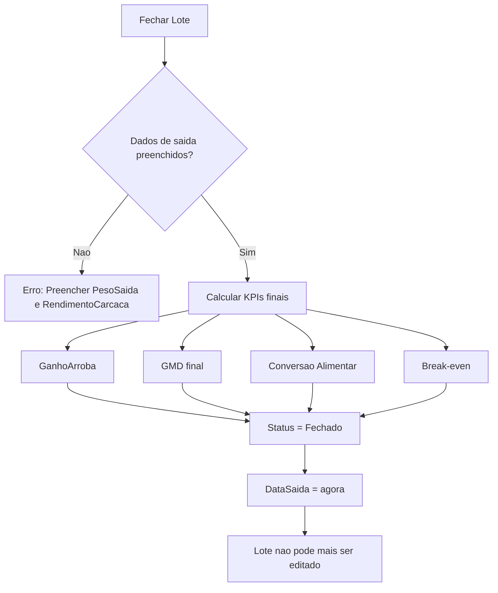

# Regras de Negocio

Formulas, calculos e regras de negocio do sistema TepConfina.

## Calculos de Peso

### Peso Medio

O peso medio e calculado dividindo o peso liquido total pela quantidade de animais:

```
PesoMedio = PesoLiquido / QuantidadeAnimais
```

!!! example "Exemplo"
    Peso liquido do lote: 15.000 kg, quantidade: 30 animais.
    Peso medio = 15.000 / 30 = **500 kg/cabeca**

### Peso em Arrobas

A conversao de quilogramas para arrobas utiliza o fator padrao de 15 kg:

```
PesoArroba = Peso / 15
```

| Peso (kg) | Peso (@)  |
|-----------|-----------|
| 300       | 20,00     |
| 450       | 30,00     |
| 510       | 34,00     |

!!! info "Convencao"
    No mercado pecuario brasileiro, 1 arroba (@) equivale a 15 kg de carcaca.

## Rendimento de Carcaca

Percentual do peso vivo que se converte em carcaca apos o abate:

```
RendimentoCarcaca = (PesoCarcaca / PesoVivo) * 100
```

!!! example "Exemplo"
    Animal com 540 kg de peso vivo e 291,6 kg de carcaca.
    Rendimento = (291,6 / 540) * 100 = **54%**

### Faixas de Referencia

| Classificacao | Rendimento       |
|---------------|------------------|
| Baixo         | < 50%            |
| Adequado      | 50% - 54%        |
| Bom           | 54% - 56%        |
| Excelente     | > 56%            |

## Ganho em Arrobas

Calculo do ganho liquido em arrobas durante o periodo de confinamento:

```
GanhoArroba = (PesoSaida * RendimentoCarcaca/100 - PesoEntrada) / 15
```

!!! example "Exemplo"
    Peso de saida: 540 kg, rendimento: 54%, peso de entrada: 360 kg.
    Ganho = (540 * 0,54 - 360) / 15 = (291,6 - 360) / 15
    Neste caso, considera-se o peso de carcaca na saida vs entrada.

## GMD - Ganho Medio Diario

Taxa de ganho de peso diario entre duas pesagens:

```
GMD = (PesoAtual - PesoAnterior) / DiasEntrePesagens
```

!!! example "Exemplo"
    Peso anterior: 450 kg (dia 0), peso atual: 492 kg (dia 28).
    GMD = (492 - 450) / 28 = **1,50 kg/dia**

### Faixas de Referencia GMD

| Classificacao | GMD (kg/dia) |
|---------------|--------------|
| Baixo         | < 1,00       |
| Adequado      | 1,00 - 1,40  |
| Bom           | 1,40 - 1,80  |
| Excelente     | > 1,80       |

## Conversao Alimentar

Relacao entre a quantidade de racao consumida e o ganho de peso:

```
ConversaoAlimentar = KgRacaoConsumida / KgGanhoPeso
```

!!! example "Exemplo"
    Racao consumida: 252 kg, ganho de peso: 42 kg.
    Conversao = 252 / 42 = **6:1** (6 kg de racao para cada 1 kg de ganho)

### Faixas de Referencia

| Classificacao | Conversao  |
|---------------|------------|
| Excelente     | < 5:1      |
| Bom           | 5:1 - 6:1  |
| Adequado      | 6:1 - 7:1  |
| Ruim          | > 7:1      |

## Break-even (Ponto de Equilibrio)

Calculo do preco minimo da arroba para cobrir os custos:

```
BreakEven = CustoTotal / QuantidadeAnimais / PrecoArroba
```

Onde `CustoTotal` inclui:

- Custo de aquisicao dos animais
- Custo total de racao consumida
- Custo de medicamentos aplicados
- Outros gastos operacionais

!!! warning "Importancia"
    O break-even e fundamental para a decisao de venda. Se o preco de mercado da arroba esta abaixo do break-even, o lote esta operando em prejuizo.

## Regras de Fechamento de Lote

Ao fechar um lote, as seguintes regras sao aplicadas:



!!! danger "Lote Fechado"
    Uma vez que o lote e fechado, nao e possivel editar seus dados. Todos os KPIs finais sao calculados e armazenados no momento do fechamento.

### Campos obrigatorios para fechamento

| Campo             | Obrigatorio | Descricao                          |
|-------------------|-------------|-------------------------------------|
| PesoSaida         | Sim         | Peso total dos animais na saida    |
| RendimentoCarcaca  | Sim         | Percentual de rendimento           |

### KPIs calculados automaticamente

| KPI                | Formula                                            |
|--------------------|-----------------------------------------------------|
| GanhoArroba        | (PesoSaida * Rendimento/100 - PesoEntrada) / 15   |
| GMD                | (PesoMedioSaida - PesoMedioEntrada) / DiasConfinamento |
| ConversaoAlimentar | TotalRacaoConsumida / TotalGanhoPeso               |
| CustoTotal         | Aquisicao + Racao + Medicamentos + Outros          |
