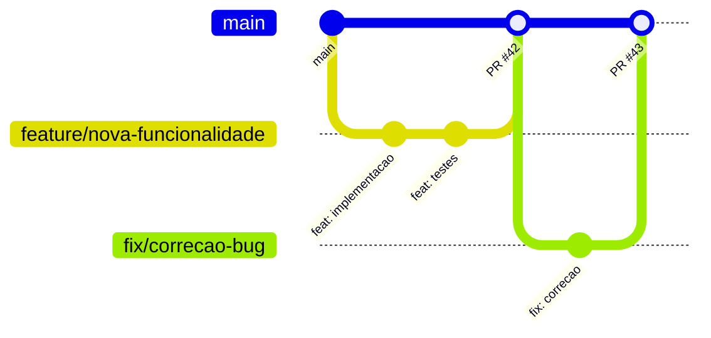

# Guia de Contribuicao

Diretrizes para contribuir com o projeto TepConfina.

## Git Flow

O projeto segue o modelo de branching baseado em trunk:



### Fluxo de Trabalho

1. Crie uma branch a partir de `main`
2. Implemente as alteracoes
3. Abra um Pull Request
4. Aguarde a revisao de codigo
5. Apos aprovacao, faca o merge

## Nomenclatura de Branches

| Prefixo     | Uso                                    | Exemplo                          |
|-------------|----------------------------------------|----------------------------------|
| `feature/`  | Novas funcionalidades                  | `feature/gestao-animais`         |
| `fix/`      | Correcoes de bugs                      | `fix/calculo-gmd-incorreto`      |
| `docs/`     | Documentacao                           | `docs/guia-deploy`               |
| `refactor/` | Refatoracao sem mudanca de comportamento| `refactor/lote-service`          |
| `test/`     | Adicao ou correcao de testes           | `test/pesagem-service`           |

## Convencao de Commits

Utilizamos [Conventional Commits](https://www.conventionalcommits.org/):

```
<tipo>(<escopo>): <descricao>
```

### Tipos Permitidos

| Tipo         | Descricao                                |
|--------------|------------------------------------------|
| `feat`       | Nova funcionalidade                      |
| `fix`        | Correcao de bug                          |
| `docs`       | Alteracao em documentacao                |
| `refactor`   | Refatoracao de codigo                    |
| `test`       | Adicao ou correcao de testes             |
| `chore`      | Tarefas de manutencao                    |
| `ci`         | Alteracao em CI/CD                       |
| `style`      | Formatacao, semicolons, etc              |
| `perf`       | Melhoria de performance                  |

### Exemplos

```bash
feat(lotes): adicionar filtro por status
fix(auth): corrigir refresh token expirado
docs(api): documentar endpoint de pesagens
refactor(services): extrair validacoes para classe separada
test(animais): adicionar testes para cadastro
```

## Template de Pull Request

```markdown
## Descricao
Breve descricao das alteracoes realizadas.

## Tipo de Alteracao
- [ ] Nova funcionalidade (feat)
- [ ] Correcao de bug (fix)
- [ ] Refatoracao (refactor)
- [ ] Documentacao (docs)

## Checklist
- [ ] Codigo segue os padroes do projeto
- [ ] Testes adicionados/atualizados
- [ ] Documentacao atualizada (se aplicavel)
- [ ] Build passa sem erros
- [ ] Sem warnings do linter

## Screenshots (se aplicavel)
```

## Checklist de Code Review

!!! note "Revisores"
    Todo PR precisa de pelo menos uma aprovacao antes do merge.

### O que verificar

- **Funcionalidade**: O codigo faz o que se propoe?
- **Testes**: Existem testes adequados? Cobrem os cenarios importantes?
- **Seguranca**: Dados sensiveis estao protegidos? Inputs sao validados?
- **Performance**: Consultas ao banco sao eficientes? Existe paginacao?
- **Legibilidade**: O codigo e claro e bem organizado?
- **Convencoes**: Segue os padroes do projeto (naming, arquitetura)?

## Padroes de Codigo

### Backend (.NET)

- Seguir Clean Architecture (Domain, Application, Infrastructure, API)
- Soft delete via `IsDeleted` (nunca deletar fisicamente)
- DTOs para comunicacao entre camadas
- Injecao de dependencia para todos os servicos

### Frontend (React)

- Componentes funcionais com TypeScript
- Zustand para estado de autenticacao
- TanStack Query para estado do servidor
- `react-hook-form` + `zod` para formularios
- Tailwind CSS para estilizacao

### Mobile (Flutter)

- Riverpod para gerenciamento de estado
- Hive para armazenamento local
- Freezed para modelos imutaveis

!!! success "Pronto para contribuir"
    Siga estas diretrizes e abra seu primeiro Pull Request. Em caso de duvidas, abra uma issue no repositorio.
