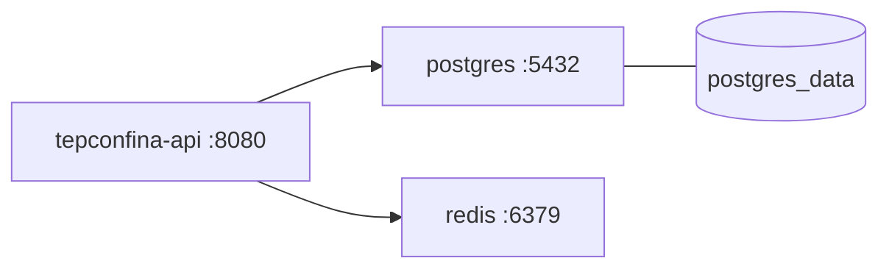

# Docker

Guia para executar o ambiente do TepConfina utilizando Docker e Docker Compose.

## Pre-requisitos

| Ferramenta     | Versao Minima | Observacao                  |
|----------------|---------------|-----------------------------|
| Docker         | 24.0          | Engine                      |
| Docker Compose | 2.20+         | Plugin integrado ao Docker  |

## Visao Geral dos Servicos

O `docker-compose.yml` define tres servicos principais:



## docker-compose.yml

```yaml
version: "3.8"

services:
  postgres:
    image: postgres:15-alpine
    container_name: tepconfina-db
    environment:
      POSTGRES_DB: tepconfina
      POSTGRES_USER: tep_sales
      POSTGRES_PASSWORD: tep_sales_dev
    ports:
      - "5432:5432"
    volumes:
      - postgres_data:/var/lib/postgresql/data
    healthcheck:
      test: ["CMD-SHELL", "pg_isready -U tep_sales -d tepconfina"]
      interval: 10s
      timeout: 5s
      retries: 5

  redis:
    image: redis:7-alpine
    container_name: tepconfina-redis
    ports:
      - "6379:6379"
    command: redis-server --appendonly yes
    healthcheck:
      test: ["CMD", "redis-cli", "ping"]
      interval: 10s
      timeout: 5s
      retries: 5

  api:
    build:
      context: .
      dockerfile: Dockerfile
    container_name: tepconfina-api
    ports:
      - "8080:8080"
    environment:
      ASPNETCORE_ENVIRONMENT: Development
      DATABASE_HOST: postgres
      DATABASE_PORT: 5432
      DATABASE_NAME: tepconfina
      DATABASE_USER: tep_sales
      DATABASE_PASSWORD: tep_sales_dev
      REDIS_CONNECTION: redis:6379
    depends_on:
      postgres:
        condition: service_healthy
      redis:
        condition: service_healthy

volumes:
  postgres_data:
```

## Comandos Principais

### Subir todos os servicos

```bash
docker-compose up -d
```

### Subir apenas infraestrutura (sem API)

```bash
docker-compose up -d postgres redis
```

!!! tip "Desenvolvimento local"
    Para desenvolvimento, suba apenas PostgreSQL e Redis via Docker e execute a API diretamente com `dotnet run`. Isso facilita o debug e hot reload.

### Verificar status dos servicos

```bash
docker-compose ps
```

### Visualizar logs

```bash
# Todos os servicos
docker-compose logs -f

# Servico especifico
docker-compose logs -f api
```

### Parar todos os servicos

```bash
docker-compose down
```

### Parar e remover volumes (dados)

```bash
docker-compose down -v
```

!!! danger "Perda de dados"
    O flag `-v` remove os volumes, apagando todos os dados do PostgreSQL. Use com cautela.

## Health Checks

Cada servico possui um health check configurado:

| Servico    | Comando de Verificacao                              | Intervalo |
|------------|-----------------------------------------------------|-----------|
| PostgreSQL | `pg_isready -U tep_sales -d tepconfina`             | 10s       |
| Redis      | `redis-cli ping`                                    | 10s       |
| API        | Depende de postgres e redis estarem healthy          | -         |

O servico `api` so inicia apos PostgreSQL e Redis estarem saudaveis, garantindo que as dependencias estejam prontas.

## Portas

| Servico    | Porta Host | Porta Container |
|------------|------------|-----------------|
| PostgreSQL | 5432       | 5432            |
| Redis      | 6379       | 6379            |
| API        | 8080       | 8080            |

## Volumes

| Volume          | Descricao                              |
|-----------------|----------------------------------------|
| `postgres_data` | Dados persistentes do PostgreSQL       |

!!! info "Persistencia"
    O volume `postgres_data` garante que os dados do banco sejam mantidos entre reinicializacoes dos containers.
