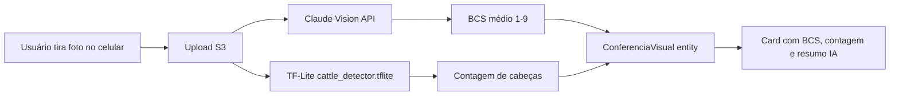

# Funcionalidades Avançadas

Recursos que vão além do básico de cadastro/pesagem/relatório. A maioria foi adicionada pós-MVP e pode estar disponível por feature flag ou plano (Premium).

---

## 1. Mercado Colaborativo

Crowdsourcing de preços de venda reportados pelos próprios produtores. Cria uma referência de **margem real** por região, complementando o preço CEPEA/BGI futuro.

**Onde:** menu **Mercado Colaborativo**.

**Como funciona:**

- Qualquer produtor pode **reportar uma negociação** (botão "Reportar Negócio") com data, UF, cidade, qtd animais, preço/@ e frigorífico.
- A página agrega:
  - **Card "vs CEPEA"** — diferencial entre o preço médio reportado e o preço de referência.
  - **Mapa de preços por UF** — média ponderada da última semana, colorido (verde = acima, vermelho = abaixo).
  - **Tabela de últimos negócios** — auditável.
- Gate **Premium** controla acesso a relatórios detalhados (não toda visualização).

!!! tip "Reciprocidade"
    Quanto mais o seu tenant reporta, melhor o sinal para todos. O cálculo de margem real dos seus lotes usa essa base como benchmark regional.

---

## 2. WhatsApp Bot

Bot integrado via **Meta Cloud API**. Envia comandos pelo WhatsApp e recebe respostas formatadas.

**Setup do produtor:**

1. Cadastrar telefone do usuário em **Perfil → Telefone WhatsApp**.
2. Enviar `oi` para o número oficial do TepConfina.
3. O bot identifica pelo número e responde com menu.

**Comandos disponíveis:**

| Comando | Resposta |
|---------|----------|
| `resumo` | Lotes ativos, total de cabeças, GMD médio, custo acumulado |
| `preço` ou `cotacao` | Preço atual do BGI1!, variação, médias 7d/30d |
| `financeiro` | Receita projetada, custo total, margem por lote |
| `lote <nome>` | Detalhe de um lote específico (peso médio, dias, GMD) |
| `IA <pergunta>` | Encaminha para o Agente IA (Claude) com contexto da operação |
| `ajuda` | Lista todos os comandos |

**Webhook:** `https://tepconfina-api.tecnoepec.com.br/api/whatsapp/webhook` (verificado, token no Secrets Manager).

---

## 3. IA Proativa (Alertas + Digest)

Sistema que analisa a operação **sem o usuário pedir** e envia alertas relevantes automaticamente.

### Alertas horários

`ProactiveAlertService` (BackgroundService, executa de hora em hora) avalia:

- **GMD vermelho** — lote com GMD abaixo de 0.9 kg/d por 3 pesagens consecutivas.
- **Saída próxima sem pesagem recente** — lote previsto para sair em ≤7 dias sem pesagem nos últimos 5 dias.
- **Variação brusca de preço** — BGI variou >2% em 24h.
- **Estoque mínimo** — qualquer insumo abaixo do mínimo configurado.
- **Mortalidade fora do padrão** — % mortalidade do lote > 2× a média do tenant.

Os alertas são enviados como **notificação push (FCM) + WhatsApp + e-mail** (configurável por usuário).

### Digest matinal (5:30 BRT)

`DailyDigestService` envia diariamente um resumo consolidado:

- KPIs do dia anterior (animais ativos, GMD médio, consumo de ração, custo)
- Lotes próximos da saída (próximos 14 dias)
- Preço atual do boi gordo + variação 24h
- Alertas pendentes não lidos

---

## 4. Conferência Visual (Computer Vision)

Análise automatizada de imagens do lote para acompanhamento de Body Condition Score (BCS) e contagem de cabeças.

**Onde:** Detalhe do Lote → aba **Conferência Visual**.

### Pipeline

**Modelo TF-Lite:** `cattle_detector.tflite` (43 MB, Git LFS) embarcado no APK Android.

**Calibragem auto-ajustante:** o detector ajusta confidence threshold com base em feedback do usuário (se ele reportar contagem errada, modelo recalibra).

**Limite:** 1 análise/lote/dia para tenants Free; ilimitada no Premium.

---

## 5. Modo Curral (Mobile)

Tela otimizada para uso **dentro do curral** com luva ou mão suja. UI simplificada, fonte grande, comandos de voz.

**Onde:** App mobile → ícone do curral no canto inferior direito.

**4 botões gigantes:**

1. **Pesagem** — abre câmera/teclado numérico para registrar peso de um animal individual (busca brinco por voz).
2. **Mortalidade** — registra morte com data atual e causa por dropdown.
3. **Medicamento** — aplica medicamento a vários animais de uma vez (lê brincos por voz).
4. **Sair** — volta ao app normal.

**Comando de voz** (Android STT):

- "pesar B001 quatrocentos e vinte" → registra B001 com 420kg
- "morte B042 pneumonia" → registra mortalidade
- "vacina B055 B056 B057" → marca os 3 como vacinados hoje

**Offline-first:** todas as ações entram em fila Hive local e são sincronizadas quando volta sinal.

---

## 6. Previsão de Venda (3 cenários)

Disponível na **Web** (Dashboard, card "Previsão Inteligente de Venda" — ver [Manual do Usuário §12](manual-usuario.md#12-previsão-inteligente-de-venda)) e no **Mobile** (aba Previsão de cada lote).

**3 cenários por lote:**

| Cenário | Preço usado |
|---------|-------------|
| Pessimista | -5% sobre o preço de referência |
| Realista | preço atual da arroba (BGI ou override manual) |
| Otimista | +5% sobre o preço de referência |

**O que mostra:**

- Receita projetada na data prevista de saída
- Custo acumulado até hoje + custo projetado até a saída
- **Margem absoluta e %**
- **Break-even** — preço da arroba mínimo para zero lucro

---

## 7. Hedge Avançado (Decision + Ladder + History)

Já documentado no [Manual do Usuário §11](manual-usuario.md#11-simulador-de-hedge). Resumo:

- **Simulador de Hedge** — calcula contratos BGI para travar o lote (modos Conservador/Balanceado/Proteção Máxima).
- **Decision Engine** — score 0–100 baseado em 5 critérios ponderados (preço, margem, base, tendência, volatilidade).
- **Hedge Ladder** — escada de travas progressiva.
- **Histórico de Hedge** — operações registradas com P&L estimado.

---

## 8. Importação Histórica (extração de planilhas legadas)

Para tenants que vêm migrando de outro sistema/planilha. Ver também [Manual §23](manual-usuario.md#23-importação-via-excel).

**Tipos suportados:**

- **Lotes históricos completos** — lote já fechado com pesagens, ração, med (importação retroativa para análise comparativa).
- **Pesagens em massa** — adicionar várias pesagens a lotes existentes.
- **Animais em lote** — popular um lote com brincos de uma planilha.

**Status atual da extração de cliente piloto** (referência interna): ver [memória project_extracao_historico](https://github.com/TecnoePec) — 12 lotes importados, 342 animais.

---

## 9. Mobile Crashlytics + Boot Safety

Crashes Android são reportados automaticamente para o Firebase Crashlytics do projeto `tep-confina`.

**Acesso:** [console.firebase.google.com/project/tep-confina/crashlytics](https://console.firebase.google.com/project/tep-confina/crashlytics)

**Boot safety:** o `main.dart` envolve a inicialização em try/catch defensivo — se um plugin falhar (Hive corrompido, FCM sem permissão), o app sobe em modo degradado em vez de tela branca.

---

## Resumo de feature flags

Algumas funcionalidades podem estar desligadas via `FeatureFlag` (gerenciado em `FeatureFlagService`):

| Flag | O que controla |
|------|----------------|
| `enable_push_notifications` | Envio de push FCM |
| `enable_cepea_scraper` | Scraper legacy CEPEA (hoje **off** — quebrado) |
| `enable_excel_export` | Botão "Exportar Excel" nos relatórios |
| `maintenance_mode` | Banner global de manutenção + bloqueia mutations |

Admins podem alternar via `/api/feature-flags`.
