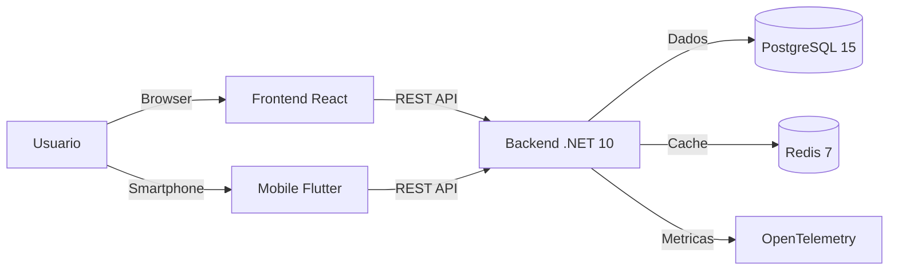

# TepConfina

**Sistema de Gestao de Confinamento Bovino** | SaaS Multi-tenant

---

## Sobre o Projeto

O **TepConfina** e uma plataforma SaaS completa para gestao de confinamento bovino, desenvolvida pela **Agropecuaria Menezes / Grupo JLM**. O sistema oferece controle total do ciclo de confinamento, desde a entrada dos animais ate o fechamento do lote com indicadores de desempenho (KPIs).

!!! tip "Destaques"
    - **Multi-tenant**: Isolamento de dados por fazenda/empresa via `TenantId`
    - **Offline-first**: App mobile funciona sem internet e sincroniza automaticamente
    - **Dashboards em tempo real**: Metricas financeiras e zootecnicas atualizadas
    - **63 funcionalidades** mapeadas e priorizadas por modulo

---

## Stack Tecnologica

| Camada       | Tecnologias                                              |
|:-------------|:---------------------------------------------------------|
| **Backend**  | .NET 10, EF Core 10, PostgreSQL 15, Redis 7             |
| **Frontend** | React 18, Vite 5, TypeScript, Tailwind 3, TanStack Query, Zustand |
| **Mobile**   | Flutter 3, Riverpod, Hive, Dio, GoRouter                |
| **Infra**    | AWS ECS Fargate, Terraform, GitHub Actions               |
| **Docs**     | MkDocs Material, Mermaid, GitHub Pages                   |

---

## Repositorios

| Repositorio                        | Descricao                        |
|:-----------------------------------|:---------------------------------|
| `TecnoePec/tepconfina-api`         | Backend .NET + Infraestrutura Terraform |
| `TecnoePec/tepconfina-web`         | Frontend React + Vite            |
| `TecnoePec/tepconfina-mobile`      | App mobile Flutter               |

---

## Navegacao Rapida

- :material-layers-outline: **[Arquitetura](arquitetura/visao-geral.md)**

    Visao geral da arquitetura, diagramas C4 e decisoes tecnicas.

- :material-api: **[API Reference](api/)**

    Endpoints REST, autenticacao, exemplos de uso.

- :material-book-open-variant: **[Guias](guias/)**

    Setup do ambiente, primeiros passos e fluxos de trabalho.

- :material-rocket-launch: **[Deploy](deploy/)**

    CI/CD, infraestrutura AWS e procedimentos de deploy.

---

## Modulos e Funcionalidades

O sistema esta organizado em modulos, totalizando **63 funcionalidades**:

| Modulo            | Funcionalidades | Status         |
|:------------------|:---------------:|:---------------|
| Autenticacao      | 5               | Implementado   |
| Dashboard         | 6               | Implementado   |
| Lotes             | 8               | Implementado   |
| Animais           | 7               | Em desenvolvimento |
| Pesagens          | 5               | Em desenvolvimento |
| Racoes/Nutricao   | 6               | Em desenvolvimento |
| Financeiro        | 8               | Planejado      |
| Mercado           | 4               | Planejado      |
| Alertas           | 5               | Planejado      |
| Produtores        | 4               | Planejado      |
| Usuarios          | 3               | Planejado      |
| Relatorios        | 2               | Planejado      |

!!! note "Roadmap"
    O roadmap completo com prazos e prioridades esta disponivel no board do projeto no GitHub Projects.

---

## Arquitetura em Alto Nivel

---

*Documentacao mantida pela equipe TecnoePec. Ultima atualizacao: Março 2026.*
