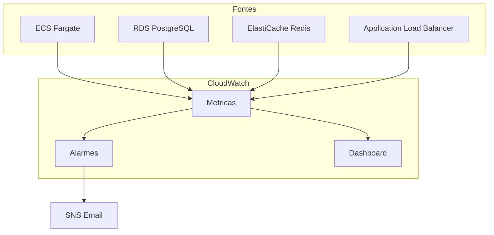

# CloudWatch

Monitoramento e alarmes do TepConfina no Amazon CloudWatch.

## Visao Geral

O CloudWatch centraliza metricas, alarmes e dashboards para monitoramento da infraestrutura e aplicacao em tempo real.



## Alarmes Configurados

### ECS Fargate

| Alarme                 | Condicao              | Periodo | Acao               |
|------------------------|-----------------------|---------|--------------------|
| CPU Alta               | CPU > 80% por 5 min  | 5 min   | SNS Notificacao    |
| Memoria Alta           | Memoria > 85% por 5 min | 5 min | SNS Notificacao   |
| Sem Tasks Rodando      | Running tasks = 0    | 1 min   | SNS Notificacao    |

### RDS PostgreSQL

| Alarme                 | Condicao              | Periodo | Acao               |
|------------------------|-----------------------|---------|--------------------|
| Conexoes Altas         | Conexoes > 80        | 5 min   | SNS Notificacao    |
| CPU Alta               | CPU > 80% por 10 min | 5 min   | SNS Notificacao    |
| Latencia de Leitura    | Read latency > 20ms  | 5 min   | SNS Notificacao    |

### ElastiCache Redis

| Alarme                 | Condicao              | Periodo | Acao               |
|------------------------|-----------------------|---------|--------------------|
| Memoria Alta           | Memoria > 80%        | 5 min   | SNS Notificacao    |

### Application Load Balancer

| Alarme                 | Condicao              | Periodo | Acao               |
|------------------------|-----------------------|---------|--------------------|
| Erros 5xx              | 5xx > 10 em 5 min    | 5 min   | SNS Notificacao    |

## Configuracao Terraform

```hcl
resource "aws_cloudwatch_metric_alarm" "ecs_cpu_high" {
  alarm_name          = "tepconfina-${var.environment}-ecs-cpu-high"
  comparison_operator = "GreaterThanThreshold"
  evaluation_periods  = 2
  metric_name         = "CPUUtilization"
  namespace           = "AWS/ECS"
  period              = 300
  statistic           = "Average"
  threshold           = 80

  dimensions = {
    ClusterName = aws_ecs_cluster.main.name
    ServiceName = aws_ecs_service.api.name
  }

  alarm_actions = [aws_sns_topic.alerts.arn]
}

resource "aws_cloudwatch_metric_alarm" "alb_5xx" {
  alarm_name          = "tepconfina-${var.environment}-alb-5xx"
  comparison_operator = "GreaterThanThreshold"
  evaluation_periods  = 1
  metric_name         = "HTTPCode_Target_5XX_Count"
  namespace           = "AWS/ApplicationELB"
  period              = 300
  statistic           = "Sum"
  threshold           = 10

  dimensions = {
    LoadBalancer = aws_lb.main.arn_suffix
  }

  alarm_actions = [aws_sns_topic.alerts.arn]
}
```

## Dashboard

O dashboard centralizado exibe as metricas mais importantes em tempo real.

### Widgets do Dashboard

| Secao         | Metricas Exibidas                              |
|---------------|-------------------------------------------------|
| ECS           | CPU Utilization, Memory Utilization             |
| ALB           | Request Count, Target Response Time, HTTP 5xx   |
| RDS           | Database Connections, CPU Utilization            |
| Redis         | Current Connections, Memory Usage               |

### Configuracao do Dashboard

```hcl
resource "aws_cloudwatch_dashboard" "main" {
  dashboard_name = "tepconfina-${var.environment}"
  dashboard_body = jsonencode({
    widgets = [
      {
        type   = "metric"
        x      = 0
        y      = 0
        width  = 12
        height = 6
        properties = {
          title   = "ECS CPU & Memory"
          metrics = [
            ["AWS/ECS", "CPUUtilization", "ClusterName", "tepconfina"],
            ["AWS/ECS", "MemoryUtilization", "ClusterName", "tepconfina"]
          ]
          period = 300
          region = var.region
        }
      }
    ]
  })
}
```

## Notificacoes SNS

Os alarmes disparam notificacoes via Amazon SNS:

| Configuracao    | Valor                              |
|-----------------|------------------------------------|
| Protocolo       | Email                              |
| Endpoint        | ops@tepconfina.com                 |
| Topico          | tepconfina-{env}-alerts            |

```hcl
resource "aws_sns_topic" "alerts" {
  name = "tepconfina-${var.environment}-alerts"
}

resource "aws_sns_topic_subscription" "email" {
  topic_arn = aws_sns_topic.alerts.arn
  protocol  = "email"
  endpoint  = "ops@tepconfina.com"
}
```

!!! info "Confirmacao de email"
    Ao criar a subscription, o AWS envia um email de confirmacao. E necessario confirmar para comecar a receber as notificacoes.

## Acesso ao Dashboard

1. Acesse o [Console AWS CloudWatch](https://console.aws.amazon.com/cloudwatch)
2. Navegue ate **Dashboards**
3. Selecione `tepconfina-production` ou `tepconfina-staging`

!!! tip "Periodo personalizado"
    Ajuste o periodo de visualizacao no canto superior direito do dashboard para analisar tendencias historicas.
