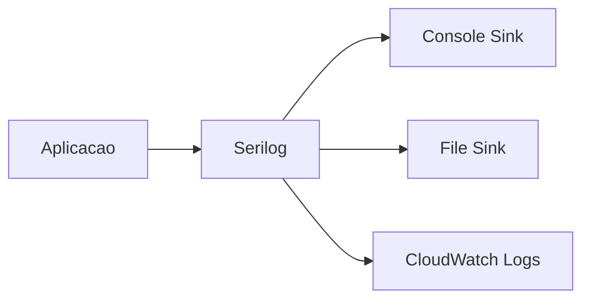

# Logs

Sistema de logging estruturado do TepConfina com Serilog.

## Visao Geral

O TepConfina utiliza Serilog para logging estruturado, facilitando a busca e analise de logs em todos os ambientes.



## Configuracao

### Program.cs

```csharp
builder.Host.UseSerilog((context, config) =>
{
    config
        .ReadFrom.Configuration(context.Configuration)
        .Enrich.FromLogContext()
        .Enrich.WithMachineName()
        .Enrich.WithEnvironmentName()
        .WriteTo.Console(new JsonFormatter())
        .WriteTo.File(
            path: "logs/tepconfina-.log",
            rollingInterval: RollingInterval.Day,
            retainedFileCountLimit: 30);
});

// Request logging middleware
app.UseSerilogRequestLogging(options =>
{
    options.EnrichDiagnosticContext = (diagnosticContext, httpContext) =>
    {
        diagnosticContext.Set("UserId",
            httpContext.User.FindFirst("sub")?.Value ?? "anonymous");
        diagnosticContext.Set("TenantId",
            httpContext.User.FindFirst("tenantId")?.Value ?? "none");
    };
});
```

## Niveis de Log

| Nivel         | Uso                                           | Exemplo                              |
|---------------|-----------------------------------------------|--------------------------------------|
| `Debug`       | Detalhes de desenvolvimento                   | Query SQL executada                  |
| `Information` | Operacoes normais do sistema                  | Lote criado, usuario logou           |
| `Warning`     | Situacoes inesperadas nao criticas            | Rate limit atingido, token expirado  |
| `Error`       | Erros que impactam funcionalidade             | Falha ao salvar no banco             |
| `Fatal`       | Erros criticos que impedem funcionamento      | Banco de dados indisponivel          |

### Configuracao por Categoria

```json
{
  "Serilog": {
    "MinimumLevel": {
      "Default": "Information",
      "Override": {
        "Microsoft.AspNetCore": "Warning",
        "Microsoft.EntityFrameworkCore": "Warning",
        "System.Net.Http.HttpClient": "Warning"
      }
    }
  }
}
```

!!! info "Override de categorias"
    Categorias do framework (ASP.NET Core, EF Core) sao configuradas com nivel `Warning` para reduzir ruido nos logs. Em desenvolvimento, altere para `Debug` quando necessario.

## Formato Estruturado

Cada entrada de log e emitida em formato JSON estruturado:

```json
{
  "Timestamp": "2026-03-07T14:30:22.123Z",
  "Level": "Information",
  "MessageTemplate": "Lote {LoteId} criado por {UserId}",
  "Properties": {
    "LoteId": "3fa85f64-5717-4562-b3fc-2c963f66afa6",
    "UserId": "7c9e6679-7425-40de-944b-e07fc1f90ae7",
    "TenantId": "a1b2c3d4-e5f6-7890-abcd-ef1234567890",
    "MachineName": "tepconfina-api-task-1",
    "Environment": "Production",
    "TraceId": "abcdef1234567890",
    "SpanId": "1234567890abcdef"
  }
}
```

## Request Logging

O middleware `UseSerilogRequestLogging` registra automaticamente cada requisicao HTTP:

```json
{
  "Timestamp": "2026-03-07T14:30:22.456Z",
  "Level": "Information",
  "MessageTemplate": "HTTP {RequestMethod} {RequestPath} responded {StatusCode} in {Elapsed:0.0000}ms",
  "Properties": {
    "RequestMethod": "GET",
    "RequestPath": "/api/lotes",
    "StatusCode": 200,
    "Elapsed": 45.2341,
    "UserId": "7c9e6679-7425-40de-944b-e07fc1f90ae7",
    "TenantId": "a1b2c3d4-e5f6-7890-abcd-ef1234567890"
  }
}
```

### Informacoes Registradas

| Campo           | Descricao                              |
|-----------------|----------------------------------------|
| RequestMethod   | Metodo HTTP (GET, POST, PUT, DELETE)   |
| RequestPath     | Caminho da requisicao                  |
| StatusCode      | Codigo de resposta HTTP                |
| Elapsed         | Tempo de processamento em ms           |
| UserId          | ID do usuario autenticado              |
| TenantId        | ID do tenant do usuario                |

## Correlation IDs

Cada requisicao carrega um `TraceId` que permite rastrear todas as operacoes relacionadas:

```csharp
// O TraceId e automaticamente propagado pelo OpenTelemetry
// e incluso em todos os logs da requisicao

_logger.LogInformation(
    "Processando lote {LoteId} - TraceId: {TraceId}",
    loteId,
    Activity.Current?.TraceId.ToString());
```

!!! tip "Rastreamento de problemas"
    Use o `TraceId` para filtrar todos os logs de uma requisicao especifica. Isso facilita o debug de problemas em producao.

## Sinks por Ambiente

| Ambiente    | Console | File   | CloudWatch |
|-------------|---------|--------|------------|
| Development | Sim     | Sim    | Nao        |
| Staging     | Sim     | Nao    | Sim        |
| Production  | Sim     | Nao    | Sim        |

## Retencao de Logs

| Ambiente    | Retencao     | Armazenamento   |
|-------------|--------------|------------------|
| Development | 30 dias      | Arquivo local    |
| Staging     | 30 dias      | CloudWatch Logs  |
| Production  | 90 dias      | CloudWatch Logs  |

## Boas Praticas

!!! warning "Dados sensiveis"
    Nunca logue dados sensiveis como senhas, tokens JWT completos, CPFs ou dados financeiros. Use mascaramento quando necessario.

- Use logging estruturado com templates: `_logger.LogInformation("Lote {LoteId} criado", loteId)`
- Evite interpolacao de string: `_logger.LogInformation($"Lote {loteId} criado")` (anti-pattern)
- Inclua contexto relevante nas mensagens (IDs, acoes)
- Use o nivel adequado para cada situacao
- Mantenha mensagens concisas e descritivas
