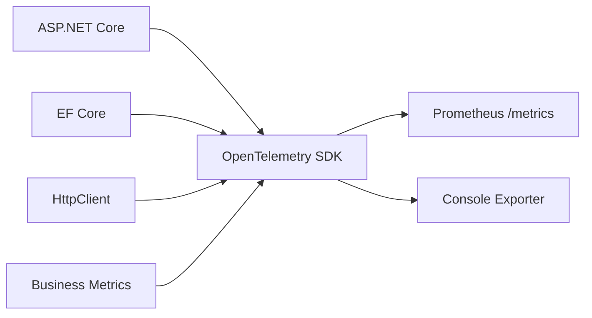

# OpenTelemetry

Instrumentacao de tracing e metricas do TepConfina com OpenTelemetry.

## Visao Geral

O TepConfina utiliza OpenTelemetry para coletar traces distribuidos e metricas de negocio, exportando dados via Prometheus.



## Tracing

### Instrumentacoes Configuradas

| Fonte                | Descricao                                    |
|----------------------|----------------------------------------------|
| ASP.NET Core         | Traces de requisicoes HTTP recebidas         |
| EF Core              | Traces de queries ao banco de dados          |
| HttpClient           | Traces de requisicoes HTTP realizadas        |

### Configuracao

```csharp
builder.Services.AddOpenTelemetry()
    .WithTracing(tracing =>
    {
        tracing
            .SetResourceBuilder(ResourceBuilder.CreateDefault()
                .AddService("TepConfina.API"))
            .AddAspNetCoreInstrumentation()
            .AddEntityFrameworkCoreInstrumentation()
            .AddHttpClientInstrumentation()
            .AddConsoleExporter();
    });
```

!!! info "Trace Context"
    Cada requisicao recebe um `TraceId` unico que e propagado por todas as operacoes, permitindo rastrear o caminho completo de uma requisicao pelo sistema.

## Metricas

### Prometheus Exporter

As metricas sao expostas no endpoint `/metrics` no formato Prometheus:

```csharp
builder.Services.AddOpenTelemetry()
    .WithMetrics(metrics =>
    {
        metrics
            .AddAspNetCoreInstrumentation()
            .AddHttpClientInstrumentation()
            .AddRuntimeInstrumentation()
            .AddMeter("TepConfina.Business")
            .AddPrometheusExporter();
    });

// No pipeline HTTP
app.MapPrometheusScrapingEndpoint();
```

### Metricas de Runtime

| Metrica                            | Descricao                          |
|------------------------------------|------------------------------------|
| `process_cpu_seconds_total`        | Tempo total de CPU consumido       |
| `dotnet_gc_collections_total`      | Coletas do garbage collector       |
| `dotnet_thread_pool_threads_total` | Threads no thread pool             |

### Metricas HTTP

| Metrica                               | Descricao                        |
|----------------------------------------|----------------------------------|
| `http_server_request_duration_seconds` | Duracao das requisicoes recebidas|
| `http_server_active_requests`          | Requisicoes ativas               |
| `http_client_request_duration_seconds` | Duracao das requisicoes enviadas |

## Metricas de Negocio

O `TepConfina.Business` meter registra metricas especificas do dominio:

### BusinessMetricsMiddleware

```csharp
public class BusinessMetricsMiddleware
{
    private static readonly Meter Meter = new("TepConfina.Business");

    private static readonly Counter<long> LoginCounter =
        Meter.CreateCounter<long>("logins", description: "Total de logins");

    private static readonly Counter<long> LotesCriadosCounter =
        Meter.CreateCounter<long>("lotes_criados", description: "Lotes criados");

    private static readonly Counter<long> AnimaisRegistradosCounter =
        Meter.CreateCounter<long>("animais_registrados", description: "Animais registrados");

    private static readonly Counter<long> ApiErrorsCounter =
        Meter.CreateCounter<long>("api_errors", description: "Erros da API");

    private static readonly Histogram<double> RequestDuration =
        Meter.CreateHistogram<double>("request_duration_ms",
            unit: "ms", description: "Duracao das requisicoes");
}
```

### Metricas Registradas

| Metrica               | Tipo      | Descricao                              |
|-----------------------|-----------|----------------------------------------|
| `logins`              | Counter   | Total de logins realizados             |
| `lotes_criados`       | Counter   | Total de lotes criados                 |
| `animais_registrados` | Counter   | Total de animais registrados           |
| `api_errors`          | Counter   | Total de erros da API (4xx e 5xx)      |
| `request_duration_ms` | Histogram | Distribuicao de duracao das requisicoes|

### Normalizacao de Paths

O middleware normaliza paths para evitar alta cardinalidade nas metricas:

```csharp
private string NormalizePath(string path)
{
    // /api/lotes/3fa85f64-5717-4562-b3fc-2c963f66afa6
    // -> /api/lotes/{id}
    return Regex.Replace(path,
        @"[0-9a-f]{8}-[0-9a-f]{4}-[0-9a-f]{4}-[0-9a-f]{4}-[0-9a-f]{12}",
        "{id}");
}
```

!!! warning "Alta cardinalidade"
    Sem normalizacao, cada GUID geraria uma serie temporal unica, causando problemas de performance no Prometheus.

## Acessando Metricas

### Endpoint local

```bash
curl http://localhost:5000/metrics
```

### Exemplo de output

```
# HELP logins Total de logins
# TYPE logins counter
logins 142

# HELP lotes_criados Lotes criados
# TYPE lotes_criados counter
lotes_criados 37

# HELP request_duration_ms Duracao das requisicoes
# TYPE request_duration_ms histogram
request_duration_ms_bucket{le="50"} 1250
request_duration_ms_bucket{le="100"} 1890
request_duration_ms_bucket{le="500"} 2100
request_duration_ms_sum 45230.5
request_duration_ms_count 2150
```

## Integracao com CloudWatch

Em producao, as metricas do Prometheus sao coletadas pelo CloudWatch Agent e disponibilizadas no dashboard centralizado.

!!! tip "Dashboards"
    Consulte a pagina de [CloudWatch](cloudwatch.md) para detalhes sobre os dashboards e alarmes configurados.
