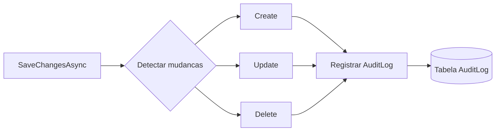

# Auditoria

Sistema de auditoria e rastreamento de operacoes do TepConfina.

## Visao Geral

Todas as operacoes de criacao, atualizacao e exclusao sao registradas automaticamente no log de auditoria, permitindo rastreabilidade completa das acoes realizadas no sistema.



## Entidade AuditLog

| Campo      | Tipo       | Descricao                                    |
|------------|------------|----------------------------------------------|
| Id         | `Guid`     | Identificador unico do registro de auditoria |
| UserId     | `Guid`     | ID do usuario que realizou a acao            |
| EntityName | `string`   | Nome da entidade afetada (ex: Lote, Animal)  |
| EntityId   | `Guid`     | ID da entidade afetada                       |
| Action     | `string`   | Tipo da acao: Create, Update, Delete         |
| OldValues  | `string?`  | Valores anteriores serializados em JSON      |
| NewValues  | `string?`  | Novos valores serializados em JSON           |
| Timestamp  | `DateTime` | Data e hora exata da operacao (UTC)          |

## Implementacao

### Interceptacao no DbContext

A auditoria e implementada sobrescrevendo o `SaveChangesAsync` do DbContext:

```csharp
public override async Task<int> SaveChangesAsync(CancellationToken ct = default)
{
    var auditEntries = new List<AuditLog>();

    foreach (var entry in ChangeTracker.Entries<BaseEntity>())
    {
        if (entry.State == EntityState.Unchanged)
            continue;

        var audit = new AuditLog
        {
            UserId = _currentUserProvider.UserId,
            EntityName = entry.Entity.GetType().Name,
            EntityId = entry.Entity.Id,
            Timestamp = DateTime.UtcNow
        };

        switch (entry.State)
        {
            case EntityState.Added:
                audit.Action = "Create";
                audit.NewValues = SerializeEntity(entry);
                break;

            case EntityState.Modified:
                audit.Action = "Update";
                audit.OldValues = SerializeOriginalValues(entry);
                audit.NewValues = SerializeCurrentValues(entry);
                break;

            case EntityState.Deleted:
                audit.Action = "Delete";
                audit.OldValues = SerializeEntity(entry);
                break;
        }

        auditEntries.Add(audit);
    }

    var result = await base.SaveChangesAsync(ct);

    if (auditEntries.Any())
    {
        AuditLogs.AddRange(auditEntries);
        await base.SaveChangesAsync(ct);
    }

    return result;
}
```

### Serializacao de Valores

Os valores sao serializados em JSON para armazenamento:

```json
{
  "OldValues": {
    "Nome": "Lote 001",
    "QuantidadeAnimais": 30,
    "Status": "Ativo"
  },
  "NewValues": {
    "Nome": "Lote 001",
    "QuantidadeAnimais": 32,
    "Status": "Ativo"
  }
}
```

!!! info "Apenas campos alterados"
    No caso de `Update`, apenas os campos que efetivamente mudaram sao registrados nos valores antigos e novos, facilitando a identificacao das alteracoes.

## Acoes Rastreadas

| Acao     | OldValues | NewValues | Descricao                          |
|----------|-----------|-----------|-------------------------------------|
| `Create` | -         | Sim       | Registro completo da nova entidade |
| `Update` | Sim       | Sim       | Valores antes e depois da alteracao|
| `Delete` | Sim       | -         | Registro completo antes da exclusao|

## ICurrentUserProvider

O provedor de contexto fornece informacoes do usuario autenticado para o registro de auditoria:

```csharp
public interface ICurrentUserProvider
{
    Guid UserId { get; }
    Guid TenantId { get; }
    string Role { get; }
    string Email { get; }
}
```

!!! warning "Contexto obrigatorio"
    O `ICurrentUserProvider` extrai dados do JWT. Operacoes realizadas sem autenticacao (como seed de dados) utilizam um usuario de sistema predefinido.

## Consulta de Auditoria

### Exemplos de consulta

```csharp
// Historico de um lote especifico
var historico = await _context.AuditLogs
    .Where(a => a.EntityName == "Lote" && a.EntityId == loteId)
    .OrderByDescending(a => a.Timestamp)
    .ToListAsync();

// Acoes de um usuario especifico
var acoesUsuario = await _context.AuditLogs
    .Where(a => a.UserId == userId)
    .OrderByDescending(a => a.Timestamp)
    .Take(50)
    .ToListAsync();
```

## Retencao de Dados

| Ambiente   | Retencao         | Observacao                      |
|------------|------------------|---------------------------------|
| Producao   | 1 ano            | Apos o periodo, arquivado em S3 |
| Staging    | 90 dias          | Limpeza automatica              |
| Dev        | 30 dias          | Limpeza automatica              |

## Entidades Auditadas

Todas as entidades que herdam de `BaseEntity` sao auditadas automaticamente:

| Entidade              | Auditada |
|-----------------------|----------|
| Lote                  | Sim      |
| Animal                | Sim      |
| Pesagem               | Sim      |
| PesagemAnimal         | Sim      |
| Racao                 | Sim      |
| ConsumoRacao          | Sim      |
| AplicacaoMedicamento  | Sim      |
| Produtor              | Sim      |
| User                  | Sim      |
| AlertaPreco           | Sim      |
| AuditLog              | Nao      |
| PrecoMercado          | Nao      |

!!! tip "AuditLog nao e auditado"
    A propria entidade `AuditLog` nao gera registros de auditoria para evitar recursao infinita.
