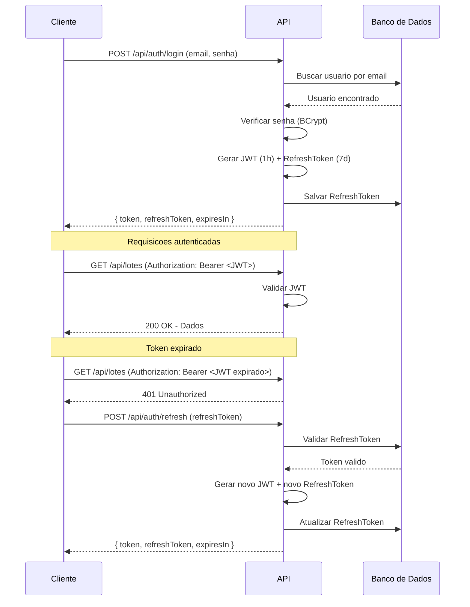

# Autenticacao

Sistema de autenticacao do TepConfina baseado em JWT com refresh token.

## Visao Geral

O TepConfina utiliza autenticacao stateless com JSON Web Tokens (JWT) e refresh tokens para manter sessoes seguras.

| Componente     | Tecnologia | Validade |
|----------------|------------|----------|
| Access Token   | JWT        | 1 hora   |
| Refresh Token  | UUID v4    | 7 dias   |
| Hash de Senha  | BCrypt     | -        |

## Fluxo de Autenticacao



## Endpoints de Autenticacao

| Metodo | Endpoint               | Descricao                    | Autenticado |
|--------|------------------------|------------------------------|-------------|
| POST   | `/api/auth/login`      | Autenticar usuario           | Nao         |
| POST   | `/api/auth/refresh`    | Renovar tokens               | Nao         |
| POST   | `/api/auth/logout`     | Invalidar refresh token      | Sim         |
| POST   | `/api/auth/register-device` | Registrar token de push | Sim         |

## JWT Claims

O token JWT contem as seguintes claims:

| Claim      | Descricao                          | Exemplo                              |
|------------|------------------------------------|--------------------------------------|
| `sub`      | ID do usuario                      | `3fa85f64-5717-4562-b3fc-2c963f66afa6` |
| `email`    | Email do usuario                   | `admin@tepconfina.com`               |
| `role`     | Papel do usuario                   | `Admin` ou `User`                    |
| `tenantId` | ID do tenant                       | `7c9e6679-7425-40de-944b-e07fc1f90ae7` |
| `iat`      | Emissao do token                   | Timestamp Unix                       |
| `exp`      | Expiracao do token                 | Timestamp Unix (+ 1 hora)            |
| `iss`      | Emissor                            | `TepConfina`                         |
| `aud`      | Audiencia                          | `TepConfinaClient`                   |

## Hash de Senha

Senhas sao armazenadas com hash BCrypt:

```csharp
// Gerar hash
var hash = BCrypt.Net.BCrypt.HashPassword(senha, workFactor: 12);

// Verificar senha
var valido = BCrypt.Net.BCrypt.Verify(senhaDigitada, hashArmazenado);
```

!!! warning "Seguranca"
    - Senhas nunca sao armazenadas em texto plano
    - O work factor 12 garante resistencia a ataques de forca bruta
    - BCrypt inclui salt automaticamente no hash

## Refresh Token

O refresh token permite renovar o JWT sem exigir que o usuario faca login novamente:

- Armazenado no banco de dados vinculado ao usuario
- Invalidado apos uso (rotacao de tokens)
- Expira apos 7 dias de inatividade

!!! info "Rotacao de tokens"
    A cada refresh, tanto o JWT quanto o refresh token sao renovados. O refresh token anterior e invalidado, prevenindo reutilizacao.

## Registro de Dispositivo

Para receber push notifications, o app mobile registra o token FCM:

```json
POST /api/auth/register-device
{
  "token": "fcm-device-token-aqui",
  "platform": "Android"
}
```

| Plataforma | Valor      |
|------------|------------|
| Android    | `Android`  |
| iOS        | `iOS`      |

## Frontend - Interceptor de Tokens

O frontend utiliza um interceptor Axios para gerenciar tokens automaticamente:

```typescript
// Interceptor que adiciona o token em todas as requisicoes
api.interceptors.request.use((config) => {
  const token = useAuthStore.getState().token;
  if (token) {
    config.headers.Authorization = `Bearer ${token}`;
  }
  return config;
});

// Interceptor que faz refresh automatico em caso de 401
api.interceptors.response.use(
  (response) => response,
  async (error) => {
    if (error.response?.status === 401) {
      const newToken = await refreshToken();
      error.config.headers.Authorization = `Bearer ${newToken}`;
      return api.request(error.config);
    }
    return Promise.reject(error);
  }
);
```

!!! success "Experiencia do usuario"
    O refresh automatico garante que o usuario nao seja deslogado inesperadamente enquanto estiver usando o sistema.
