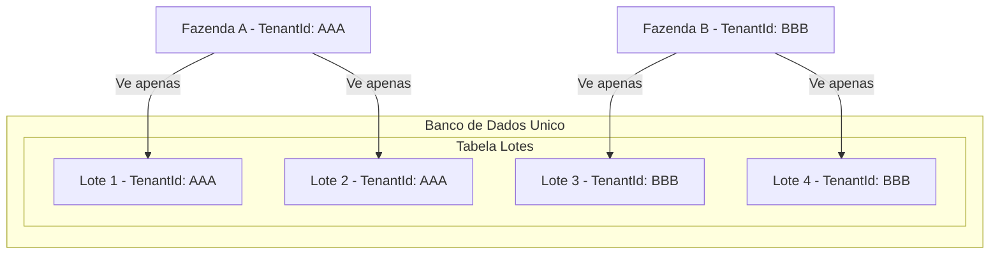

# Multi-Tenancy

Arquitetura multi-tenant do TepConfina para isolamento de dados entre organizacoes.

## Visao Geral

O TepConfina utiliza multi-tenancy por coluna discriminadora (`TenantId`), garantindo que cada organizacao/fazenda acesse apenas seus proprios dados.



## Estrategia

| Aspecto              | Implementacao                              |
|----------------------|--------------------------------------------|
| Tipo                 | Coluna discriminadora (shared database)    |
| Coluna               | `TenantId` (Guid) em todas as entidades    |
| Filtragem            | EF Core Global Query Filter                |
| Contexto             | Extraido do JWT via `ICurrentUserProvider`  |
| Isolamento           | Garantido no nivel do banco de dados       |

## Implementacao

### Coluna TenantId

Todas as entidades que herdam de `BaseEntity` possuem a coluna `TenantId`:

```csharp
public abstract class BaseEntity
{
    public Guid Id { get; set; }
    public Guid TenantId { get; set; }
    public DateTime CreatedAt { get; set; }
    public DateTime? UpdatedAt { get; set; }
    public bool IsDeleted { get; set; }
}
```

### Global Query Filter

O EF Core aplica automaticamente um filtro em todas as consultas:

```csharp
protected override void OnModelCreating(ModelBuilder modelBuilder)
{
    var currentTenantId = _currentUserProvider.TenantId;

    modelBuilder.Entity<Lote>()
        .HasQueryFilter(e => !e.IsDeleted && e.TenantId == currentTenantId);

    modelBuilder.Entity<Animal>()
        .HasQueryFilter(e => !e.IsDeleted && e.TenantId == currentTenantId);

    // Aplicado a todas as entidades...
}
```

!!! info "Duplo filtro"
    O global query filter combina duas condicoes: `IsDeleted == false` (soft delete) e `TenantId == currentTenantId` (isolamento de tenant).

### ICurrentUserProvider

Interface que extrai informacoes do usuario autenticado a partir do JWT:

```csharp
public interface ICurrentUserProvider
{
    Guid UserId { get; }
    Guid TenantId { get; }
    string Role { get; }
    string Email { get; }
}

public class CurrentUserProvider : ICurrentUserProvider
{
    private readonly IHttpContextAccessor _httpContextAccessor;

    public Guid TenantId =>
        Guid.Parse(_httpContextAccessor.HttpContext?.User
            .FindFirst("tenantId")?.Value ?? Guid.Empty.ToString());

    // Demais propriedades...
}
```

### Atribuicao Automatica

O `TenantId` e atribuido automaticamente ao salvar novos registros:

```csharp
public override async Task<int> SaveChangesAsync(CancellationToken ct = default)
{
    foreach (var entry in ChangeTracker.Entries<BaseEntity>())
    {
        if (entry.State == EntityState.Added)
        {
            entry.Entity.TenantId = _currentUserProvider.TenantId;
            entry.Entity.CreatedAt = DateTime.UtcNow;
        }
    }
    return await base.SaveChangesAsync(ct);
}
```

## Seguranca

!!! warning "Garantias de isolamento"
    O global query filter e aplicado em **todas** as consultas, incluindo LINQ, raw SQL via `FromSqlRaw` (quando usando DbSet) e navegacoes de entidades.

### O que esta protegido

| Operacao            | Protecao                                    |
|---------------------|----------------------------------------------|
| Consultas (SELECT)  | Filtro automatico por TenantId              |
| Insercoes (INSERT)  | TenantId atribuido automaticamente          |
| Atualizacoes (UPDATE) | Filtro impede acesso a dados de outro tenant |
| Exclusoes (DELETE)  | Filtro impede exclusao de dados de outro tenant |

### Cenarios de ataque prevenidos

- **Acesso horizontal**: Usuario do Tenant A nao consegue acessar dados do Tenant B, mesmo manipulando IDs nas requisicoes
- **Enumeracao**: Listagens retornam apenas dados do tenant do usuario autenticado
- **Manipulacao de TenantId**: O TenantId e extraido do JWT (servidor), nao de parametros da requisicao (cliente)

## Excecoes ao Filtro

Algumas entidades nao possuem filtro de tenant:

| Entidade     | Motivo                                       |
|--------------|----------------------------------------------|
| PrecoMercado | Dados publicos de cotacoes compartilhados    |
| AuditLog     | Administradores podem consultar cross-tenant |

!!! tip "IgnoreQueryFilters"
    Em casos especificos (administracao), e possivel ignorar o filtro com `.IgnoreQueryFilters()`. Use com extrema cautela e apenas em contextos administrativos autorizados.
