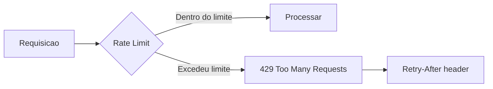

# Rate Limiting

Controle de taxa de requisicoes do TepConfina para protecao contra abuso.

## Visao Geral

O sistema implementa rate limiting em duas camadas para proteger a API contra uso excessivo e ataques de forca bruta.



## Politicas Configuradas

### Politica Global

Aplicada a todos os endpoints da API.

| Configuracao       | Valor                  |
|--------------------|------------------------|
| Limite             | 100 requisicoes        |
| Janela             | 1 minuto               |
| Tipo de janela     | Sliding Window         |
| Identificador      | IP do cliente          |

### Politica de Autenticacao

Aplicada especificamente aos endpoints de autenticacao (`/api/auth/*`).

| Configuracao       | Valor                  |
|--------------------|------------------------|
| Limite             | 10 requisicoes         |
| Janela             | 1 minuto               |
| Tipo de janela     | Fixed Window           |
| Identificador      | IP do cliente          |

!!! warning "Protecao contra forca bruta"
    O limite mais restritivo nos endpoints de autenticacao previne ataques de forca bruta contra senhas de usuarios.

## Implementacao

### Configuracao no Program.cs

```csharp
builder.Services.AddRateLimiter(options =>
{
    // Politica global
    options.GlobalLimiter = PartitionedRateLimiter.Create<HttpContext, string>(
        context => RateLimitPartition.GetSlidingWindowLimiter(
            partitionKey: context.Connection.RemoteIpAddress?.ToString() ?? "unknown",
            factory: _ => new SlidingWindowRateLimiterOptions
            {
                PermitLimit = 100,
                Window = TimeSpan.FromMinutes(1),
                SegmentsPerWindow = 4
            }));

    // Politica de autenticacao
    options.AddFixedWindowLimiter("auth", opt =>
    {
        opt.PermitLimit = 10;
        opt.Window = TimeSpan.FromMinutes(1);
    });

    options.RejectionStatusCode = StatusCodes.Status429TooManyRequests;
});
```

### Aplicacao nos Controllers

```csharp
[ApiController]
[Route("api/[controller]")]
[EnableRateLimiting("auth")]
public class AuthController : ControllerBase
{
    [HttpPost("login")]
    public async Task<IActionResult> Login(LoginRequest request) { }

    [HttpPost("refresh")]
    public async Task<IActionResult> Refresh(RefreshRequest request) { }
}
```

## Resposta de Limite Excedido

Quando o limite e excedido, a API retorna:

### HTTP Response

```http
HTTP/1.1 429 Too Many Requests
Retry-After: 30
Content-Type: application/json

{
  "title": "Too Many Requests",
  "status": 429,
  "detail": "Limite de requisicoes excedido. Tente novamente apos o periodo indicado."
}
```

### Headers de Resposta

| Header                    | Descricao                                      |
|---------------------------|-------------------------------------------------|
| `Retry-After`             | Segundos ate o proximo periodo disponivel       |
| `X-RateLimit-Limit`       | Limite total de requisicoes na janela           |
| `X-RateLimit-Remaining`   | Requisicoes restantes na janela atual           |
| `X-RateLimit-Reset`       | Timestamp de quando a janela reseta             |

## Tipos de Janela

### Sliding Window (Global)

A janela deslizante oferece uma experiencia mais suave, pois o limite e distribuido ao longo do tempo:

```
Tempo:    |----seg1----|----seg2----|----seg3----|----seg4----|
Limite:   25 req/seg   25 req/seg   25 req/seg   25 req/seg
Total:    100 requisicoes por minuto (janela deslizante)
```

### Fixed Window (Autenticacao)

A janela fixa reseta o contador a cada intervalo completo:

```
Tempo:    |--------1 minuto--------|--------1 minuto--------|
Limite:   10 requisicoes           10 requisicoes
Reset:    Contador volta a zero    Contador volta a zero
```

## Tratamento no Frontend

O frontend trata automaticamente respostas 429:

```typescript
api.interceptors.response.use(
  (response) => response,
  async (error) => {
    if (error.response?.status === 429) {
      const retryAfter = error.response.headers['retry-after'] || 30;
      await delay(retryAfter * 1000);
      return api.request(error.config);
    }
    return Promise.reject(error);
  }
);
```

!!! tip "Boas praticas para clientes"
    - Implemente backoff exponencial ao receber 429
    - Respeite o header `Retry-After`
    - Evite fazer requisicoes desnecessarias (use cache local)
    - Agrupe operacoes quando possivel
